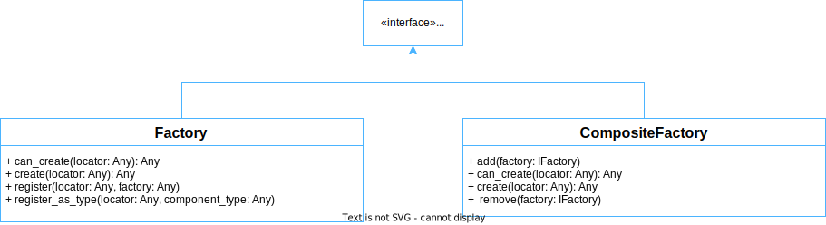

### Key takeaways

### Introduction

This tutorial will teach you how to create factories for custom and built-in components. For this, we will first understand the IFactory interface and its relations with the Factory and CompositeFactory components. Then, we will learn how to create a factory that helps build custom and existing components and how to use default factories. Next, we will see how to create a composite factory that groups several factories together. Finally, we will review all the concepts learned.

### IFactory

This interface provides methods used by factories to create components. The factories implementing this interface identify components by locators, which are usually defined by descriptors. 

This interface is implemented by both, the Factory and the CompositeFactory classes. The diagram below shows their relations:

### Factory

This class represents a basic factory that creates components using registered types and factory functions. 

To understand how this class works, we will use an example where we create a factory and then a custom component with it. The following sections will take us step-by-step in the construction of this program.

#### Pre-requisites

In order to create a factory, we need to import the Factory class. This can be done with the following command:

#### Custom component

Next, we create a basic custom component. This component includes the myTask() method, which will be used later on in this tutorial. The code below shows what this class looks like.

#### Factory and component creation

Once we have our component, we create a factory for it by defining an instance of the Factory class. Then, in order to create an instance of our custom component, we register it in the factory, and we use the factory’s create() method. The following code shows how to do this:

Which, after running, produces the following outcome, confirming that an instance of MyComponent1 has been created.

Once obtained, we can use this instance, for example, by calling one of its methods:

Which after running, produces the following result:

#### Default factories

The Pip.Services toolkit contains several factories that can be used to create some common components. These factories are all subclasses of the Factory class. Among them are:

Each of these factories has a set of default descriptors that can be employed to create available components. The following table shows the main default factories and their descriptors.

