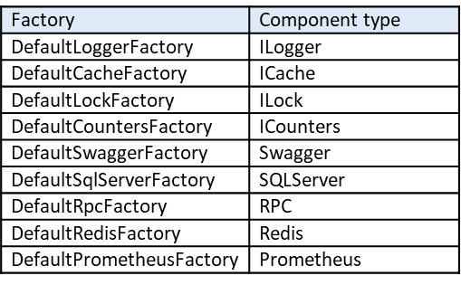

### Key takeaways

<table class="full-width-table">
  <tr>
    <td>IFactory</td>
    <td>Interface that defines methods used by component factories.</td>
  </tr>
  <tr>
    <td>Factory</td>
    <td>Basic factory used to create components via registered types and factory functions.</td>
  </tr>
  <tr>
    <td>Default factories</td>
    <td>Built-in factories included in the toolkit, which can be used to create some of the most common components.</td>
  </tr>
  <tr>
    <td>CompositeFactory</td>
    <td>Component used to group multiple factories into a single component.</td>
  </tr>
</table>

### Introduction

This tutorial will teach you how to create factories for custom and built-in components. For this, we will first understand the IFactory interface and its relations with the Factory and CompositeFactory components. Then, we will learn how to create a factory that helps build custom and existing components and how to use default factories. Next, we will see how to create a composite factory that groups several factories together. Finally, we will review all the concepts learned.

### IFactory

This interface provides methods used by factories to create components. The factories implementing this interface identify components by locators, which are usually defined by descriptors. 

This interface is implemented by both, the Factory and the CompositeFactory classes. The diagram below shows their relations:

### Factory

This class represents a basic factory that creates components using registered types and factory functions. 

To understand how this class works, we will use an example where we create a factory and then a custom component with it. The following sections will take us step-by-step in the construction of this program.

#### Pre-requisites

In order to create a factory, we need to import the Factory class. This can be done with the following command:


  Not available  



  Not available  



   Not available   



  Not available  



  



  Not available  


#### Custom component

Next, we create a basic custom component. This component includes the myTask() method, which will be used later on in this tutorial. The code below shows what this class looks like.


  Not available  



  Not available  



   Not available   



  Not available  



  



  Not available  


#### Factory and component creation

Once we have our component, we create a factory for it by defining an instance of the Factory class. Then, in order to create an instance of our custom component, we register it in the factory, and we use the factory’s create() method. The following code shows how to do this:


  Not available  



  Not available  



   Not available   



  Not available  



  



  Not available  


Which, after running, produces the following outcome, confirming that an instance of MyComponent1 has been created.

Once obtained, we can use this instance, for example, by calling one of its methods:


  Not available  



  Not available  



   Not available   



  Not available  



  



  Not available  


Which after running, produces the following result:

#### Default factories

The Pip.Services toolkit contains several factories that can be used to create some common components. These factories are all subclasses of the Factory class. Among them are:

Each of these factories has a set of default descriptors that can be employed to create available components. The following table shows the main default factories and their descriptors.

#### Default factories and component creation

In order to learn how to use the toolkit’s default factories, we will create a memory lock. The procedure also applies to other default factories and their components.

For this, we need to import the default factory first. In addition, we need to import the Descriptor class, as we use it to locate the memory lock. These actions can be done with the following commands:


  Not available  



  Not available  



   Not available   



  Not available  



  



  Not available  


Once we have imported these two components, we create an instance of the default factory.


  Not available  



  Not available  



   Not available   



  Not available  



  



  Not available  


And then, we create an instance of MemoryLock by using the corresponding descriptor (see table above).


  Not available  



  Not available  



   Not available   



  Not available  



  



  Not available  


We can verify that we have created a memory lock by checking the object’s type. The following command shows how to do this:


  Not available  



  Not available  



   Not available   



  Not available  



  



  Not available  


Which after running, returns the following output:

### CompositeFactory

This component allows us to group one or more factories into one entity, and then, call the one(s) we need independently.

In this section’s example, we will build a component that contains two factories namely, a factory for the custom component we created in the previous example and a factory for a logger.

#### Pre-requisites

In order to create a composite factory, we need to import the CompositeFactory class first. This can be done with the following command:


  Not available  



  Not available  



   Not available   



  Not available  



  



  Not available  


#### Composite factory

Once we have imported the base class, we can create an instance of it.


  Not available  



  Not available  



   Not available   



  Not available  



  



  Not available  


Now, we create a factory for the custom component defined in the previous example. Then, we register the component and add its factory to the composite factory. The code below shows how to do this:


  Not available  



  Not available  



   Not available   



  Not available  



  



  Not available  


Next, we include a factory for a logger by adding its default factory.


  Not available  



  Not available  



   Not available   



  Not available  



  



  Not available  


Once we have our composite factory with all its elements included, we can call the factory for our custom component via its descriptor and use it to create an instance of our custom component. The following code shows how this can be done:


  Not available  



  Not available  



   Not available   



  Not available  



  



  Not available  


Which, after running, produces the following result:

Similarly, we can call the logger factory and create an instance of a logger. The following code shows this step:


  Not available  



  Not available  



   Not available   



  Not available  



  



  Not available  


Which after running provides the following result that shows that an instance of a logger was created:

### Wrapping up
In this tutorial, we have learned how to create a factory that can be used to build a component. We have also understood how to use default factories, build a composite factory that includes one or more factories, and call any of the contained factories and create an instance of a component with it.
