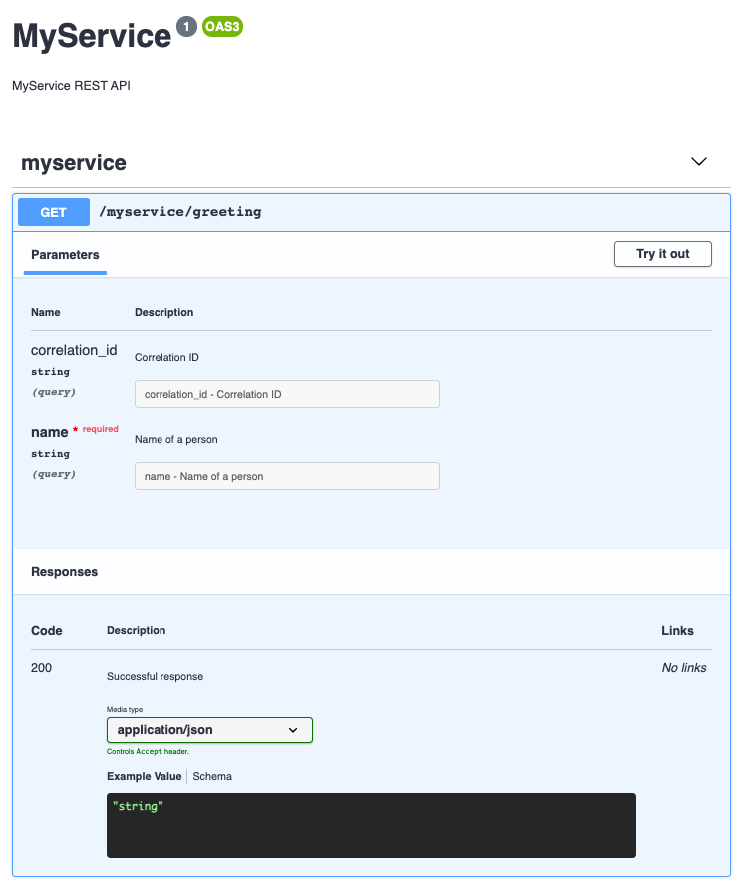

### Packages

The module contains the following packages:

- [**Build**](build) - Swagger service factory
- [**Services**](services) - Swagger UI service

### Use

Install the NPM package as
```bash
npm install pip-services3-swagger-nodex --save
```

Develop a RESTful service component. For example, it may look the following way.
In the `register` method we load an Open API specification for the service.
You can also enable swagger by default in the constractor by setting `_swaggerEnable` property.
```typescript
export class MyRestService extends RestService {
    public constructor() {
        super();
        this._baseRoute = "myservice";
        this._swaggerEnable = true;
    }

    private greeting(req, res) {
        let name = req.params.name;
        let response = "Hello, " + name + "!";
        this.sendResult(req, res, response);
    }
        
    public register() {
        this.registerRoute(
            'get', '/greeting', 
            new ObjectSchema(true)
                .withRequiredProperty("name", TypeCode.String),
            this.greeting
        );
        
        this.registerOpenApiSpecFromFile('./src/services/myservice.yml');
    }
}
```

The Open API specification for the service shall be prepared either manually
or using [Swagger Editor](https://editor.swagger.io/)
```yaml
openapi: '3.0.2'
info:
  title: 'MyService'
  description: 'MyService REST API'
  version: '1'
paths:
  /myservice/greeting:
    get:
      tags:
        - myservice
      operationId: 'greeting'
      parameters:
      - name: correlation_id
        in: query
        description: Correlation ID
        required: false
        schema:
          type: string
      - name: name
        in: query
        description: Name of a person
        required: true
        schema:
          type: string
      responses:
        200:
          description: 'Successful response'
          content:
            application/json:
              schema:
                type: 'string'
```

Include Swagger service into `config.yml` file and enable swagger for your REST or Commandable HTTP services.
Also explicitely adding HttpEndpoint allows to share the same port betwee REST services and the Swagger service.
```yaml
---
...
# Shared HTTP Endpoint
- descriptor: "pip-services:endpoint:http:default:1.0"
  connection:
    protocol: http
    host: localhost
    port: 8080

# Swagger Service
- descriptor: "pip-services:swagger-service:http:default:1.0"

# My RESTful Service
- descriptor: "myservice:service:rest:default:1.0"
  swagger:
    enable: true
```

Finally, remember to add factories to your container, to allow it creating required components.
```typescript
...
import { DefaultRpcFactory } from 'pip-services3-rpc-nodex';
import { DefaultSwaggerFactory } from 'pip-services3-swagger-nodex';

export class MyProcess extends ProcessContainer {
  public constructor() {
    super("myservice", "MyService microservice");
    
    this._factories.add(new DefaultRpcFactory());
    this._factories.add(new DefaultSwaggerFactory());
    this._factories.add(new MyServiceFactory());
    ...
  }
}
```

Launch the microservice and open the browser to open the Open API specification at
[http://localhost:8080/greeting/swagger](http://localhost:8080/greeting/swagger)

Then open the Swagger UI using the link [http://localhost:8080/swagger](http://localhost:8080/swagger).
The result shall look similar to the picture below.


