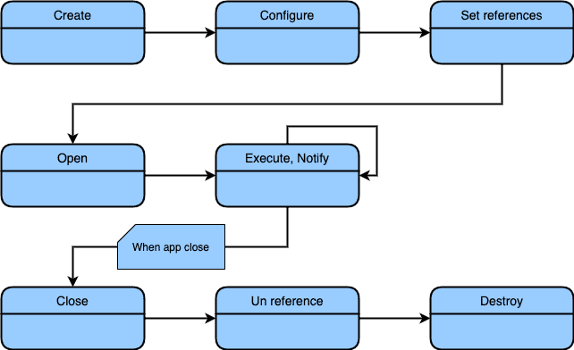



### Components and their interfaces

The Pip.Services toolkit is based on components. The component definition is very flexible. It allows users to create components from scratch, convert existing pieces of code into a component or choose from a large collection of prebuilt components. In the toolkit, any class (or struct in non-OOP languages) can be a component. Additional capabilities can be added via a few standard interfaces that enable specific states in the component lifecycle.

The component interfaces are optional, and can be used in any combination. They are defined in the commons module:

- The IConfigurable interface with the configure method allows passing component configuration parameters. The configurations defined in the ConfigParams object may come from different sources and can be defined during design, runtime or deployment time. Typically components are configured once, right after creation. IReconfigurable interface signifies that components can receive and process configurations more than once.

- The IReferenceable interface sets component dependencies. It represents the locator pattern, then dependencies are retrieved from an IReferences object passed to the component via the setReferences method using a special locator. Locators can be any values, but the PipServices toolkit most often uses Descriptors, which allow matching dependencies using 5 fields: logical group, logical type, implementation type (kind), unique object name and implementation version. The IUnreferenceable interface notifies components via the unsetReferences method to release dependencies before the component is destroyed.

- The IOpenable interface allows components to establish connections, start active threads, or do other things when they are open to prepare for handling incoming calls. On close, the collections are released and resources are freed. The IClosable interface is a subset of IOpenable with only the close method in it.

- The IExecutable interface allows components to process incoming calls by implementing an execute method. And the INotifiable interface receives asynchronous notifications via the notify method.

- The ICleanable method is used to clear a component’s state. That can be handy in situations like resetting components in automated tests.

A component that implements all standard interfaces looks the following way:


  Not available



    



  Not available  



  Not available



  Not available



  Not available  


### Containers and their configurations

Components can be created, referenced and opened manually. That is usually done in unit tests. However, the most power and flexibility comes when components can be created and managed by inversion of control containers.

The most basic container can be instantiated in-process. On top of it, the Pip.Services toolkit creates a variety of other containers, that allow to assemble microservices from components and deploy them on different platforms. These are:

- ProcessContainer: used to run microservices as system processes or package them into Docker containers.
- LambdaFunction: used to deploy microservices as AWS Lambda.
- AzureFunction: used to deploy microservices as Azure Functions.
- CloudFunction: used to deploy microservices as Google Cloud Functions.
