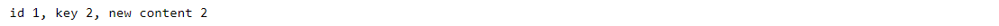

### Key takeaways

<table>
  <tr>
    <td>Memory persistence</td>
    <td>Create a memory persistence component and perform CRUD operations.</td>
  </tr>
 </table>
 
### Introduction

In this tutorial, you will learn how to create a persistence component, which will store some objects in memory. Then, we will see how to perform CRUD operations, such as adding data, reading it, updating stored values and deleting them. We will use a dummy object, which has the characteristic of being identifiable via an id parameter. All concepts learned here can be expanded to other more complex objects.

### Create a memory persistence component
In order to create our memory persistence component, we will follow these two steps.

#### Step 1 - Creating a dummy class

We will create a dummy class, which represents an object that is identifiable via an id. PIP.Services provides us with the [IStringdentifiable](http://docs.pipservices.org/python/commons/data/istring_identifiable/) interface that can be used to create data objects with this characteristic. We will also define a **content** parameter for the class, which can include any text. 

Once we created our class, we will create three instances of it, each with a different id. For one of the objects, we will use **None** to let the program define its id.
The code will look something like this: 

	

	  <button type="button" class="btn btn-outline-secondary lang-select-btn">Node</button>
	  <button type="button" class="btn btn-outline-secondary lang-select-btn">.NET</button>
	  <button type="button" class="btn btn-outline-secondary lang-select-btn">Golang</button>
	  <button type="button" class="btn btn-outline-secondary lang-select-btn">Dart</button>
	  <button type="button" class="btn btn-outline-secondary lang-select-btn">Python</button>
	  <button type="button" class="btn btn-outline-secondary lang-select-btn">Java</button>
	

  Not available  

  Not available  

  Not available  

  Not available  

  

  Not available  

#### Step 2 – Create a memory persistence object
The next step is to create a memory persistence object. Here, we need to use the [IdentifiableMemoryPersistence](http://docs.pipservices.org/python/data/persistence/identifiable_memory_persistence/) class, which is an abstract persistence component that stores data in memory and implements CRUD operations over data items with unique ids. We will also define two methods namely, **get_page_by_filter** and **get_one_by_key**, which will be used to read the persisted values.

 

	

	  <button type="button" class="btn btn-outline-secondary lang-select-btn">Node</button>
	  <button type="button" class="btn btn-outline-secondary lang-select-btn">.NET</button>
	  <button type="button" class="btn btn-outline-secondary lang-select-btn">Golang</button>
	  <button type="button" class="btn btn-outline-secondary lang-select-btn">Dart</button>
	  <button type="button" class="btn btn-outline-secondary lang-select-btn">Python</button>
	  <button type="button" class="btn btn-outline-secondary lang-select-btn">Java</button>
	

  Not available  

  Not available  

  Not available  

  Not available  

  

  Not available  

 
  
### CRUD operations

Now that we have a persistence object, we will perform CRUD operations.

#### Create the persisted objects
To add values to the persistence object, we will use the **create** method. This method asks for two parameters: correlation_id and the object to persist. For the correlation_id we will use None as in our example we are not interested in following a sequence of operations.

	

	  <button type="button" class="btn btn-outline-secondary lang-select-btn">Node</button>
	  <button type="button" class="btn btn-outline-secondary lang-select-btn">.NET</button>
	  <button type="button" class="btn btn-outline-secondary lang-select-btn">Golang</button>
	  <button type="button" class="btn btn-outline-secondary lang-select-btn">Dart</button>
	  <button type="button" class="btn btn-outline-secondary lang-select-btn">Python</button>
	  <button type="button" class="btn btn-outline-secondary lang-select-btn">Java</button>
	

  Not available  

  Not available  

  Not available  

  Not available  

  

  Not available  

  
 
  
After creating the persisted objects, we will obtain the following output:

As we can see, the memory persistence object allocated a value to the id of dummy3, which we had declared as None.

#### Read the values from the persistence object

To read the persisted values, we can use the **get_page_by_filter** method that we defined when we created the memory persistence object. Here, we will use a filter to indicate that we are only looking for the dummy2 object. 

	

	  <button type="button" class="btn btn-outline-secondary lang-select-btn">Node</button>
	  <button type="button" class="btn btn-outline-secondary lang-select-btn">.NET</button>
	  <button type="button" class="btn btn-outline-secondary lang-select-btn">Golang</button>
	  <button type="button" class="btn btn-outline-secondary lang-select-btn">Dart</button>
	  <button type="button" class="btn btn-outline-secondary lang-select-btn">Python</button>
	  <button type="button" class="btn btn-outline-secondary lang-select-btn">Java</button>
	

  Not available  

  Not available  

  Not available  

  Not available  

  

  Not available  

  
  
The **result** object is of type [DataPage](http://docs.pipservices.org/python/commons/data/data_page/), which has two fields: data and total. The first is a list containing the items on the retrieved page, and the second is the total number of items in our request. After running this code, we will see the following output with the values of the obtained object.

Similarly, we can obtain all the persisted objects by using None as our filter.

	

	  <button type="button" class="btn btn-outline-secondary lang-select-btn">Node</button>
	  <button type="button" class="btn btn-outline-secondary lang-select-btn">.NET</button>
	  <button type="button" class="btn btn-outline-secondary lang-select-btn">Golang</button>
	  <button type="button" class="btn btn-outline-secondary lang-select-btn">Dart</button>
	  <button type="button" class="btn btn-outline-secondary lang-select-btn">Python</button>
	  <button type="button" class="btn btn-outline-secondary lang-select-btn">Java</button>
	

  Not available  

  Not available  

  Not available  

  Not available  

  

  Not available  

  
 After running the above code, we will obtain the following result:

#### Update a value in the persistence object

To update a value in the persistence object, we need to use the **update** method. For example, we can change the content of the dummy2 persisted object to “new content 2”. 

	

	  <button type="button" class="btn btn-outline-secondary lang-select-btn">Node</button>
	  <button type="button" class="btn btn-outline-secondary lang-select-btn">.NET</button>
	  <button type="button" class="btn btn-outline-secondary lang-select-btn">Golang</button>
	  <button type="button" class="btn btn-outline-secondary lang-select-btn">Dart</button>
	  <button type="button" class="btn btn-outline-secondary lang-select-btn">Python</button>
	  <button type="button" class="btn btn-outline-secondary lang-select-btn">Java</button>
	

  Not available  

  Not available  

  Not available  

  Not available  

  

  Not available  

  
To verify the change, we can extract the dummy2 object by applying a filter:
 

	

	  <button type="button" class="btn btn-outline-secondary lang-select-btn">Node</button>
	  <button type="button" class="btn btn-outline-secondary lang-select-btn">.NET</button>
	  <button type="button" class="btn btn-outline-secondary lang-select-btn">Golang</button>
	  <button type="button" class="btn btn-outline-secondary lang-select-btn">Dart</button>
	  <button type="button" class="btn btn-outline-secondary lang-select-btn">Python</button>
	  <button type="button" class="btn btn-outline-secondary lang-select-btn">Java</button>
	

  Not available  

  Not available  

  Not available  

  Not available  

  

  Not available  

And get the updated object:

We can also use the **update_partially** function. In this case, we need to specify the id of the object to be updated and a dictionary (map) containing the field to be updated and its new value.

	

	  <button type="button" class="btn btn-outline-secondary lang-select-btn">Node</button>
	  <button type="button" class="btn btn-outline-secondary lang-select-btn">.NET</button>
	  <button type="button" class="btn btn-outline-secondary lang-select-btn">Golang</button>
	  <button type="button" class="btn btn-outline-secondary lang-select-btn">Dart</button>
	  <button type="button" class="btn btn-outline-secondary lang-select-btn">Python</button>
	  <button type="button" class="btn btn-outline-secondary lang-select-btn">Java</button>
	

  Not available  

  Not available  

  Not available  

  Not available  

  

  Not available  

  
  
To verify the change, we can use the filter defined earlier.
  

	

	  <button type="button" class="btn btn-outline-secondary lang-select-btn">Node</button>
	  <button type="button" class="btn btn-outline-secondary lang-select-btn">.NET</button>
	  <button type="button" class="btn btn-outline-secondary lang-select-btn">Golang</button>
	  <button type="button" class="btn btn-outline-secondary lang-select-btn">Dart</button>
	  <button type="button" class="btn btn-outline-secondary lang-select-btn">Python</button>
	  <button type="button" class="btn btn-outline-secondary lang-select-btn">Java</button>
	

  Not available  

  Not available  

  Not available  

  Not available  

  

  Not available  

And, we will obtain the updated persisted object.

#### Delete a value from the persistence object

Similarly, we can delete an object stored in the persistence object by using the **delete_by_id** function. In our example, we ask to delete dummy1 by indicating its id.
  

	

	  <button type="button" class="btn btn-outline-secondary lang-select-btn">Node</button>
	  <button type="button" class="btn btn-outline-secondary lang-select-btn">.NET</button>
	  <button type="button" class="btn btn-outline-secondary lang-select-btn">Golang</button>
	  <button type="button" class="btn btn-outline-secondary lang-select-btn">Dart</button>
	  <button type="button" class="btn btn-outline-secondary lang-select-btn">Python</button>
	  <button type="button" class="btn btn-outline-secondary lang-select-btn">Java</button>
	

  Not available  

  Not available  

  Not available  

  Not available  

  

  Not available  

To verify that the object has been deleted, we can apply a filter and search for it.

	

	  <button type="button" class="btn btn-outline-secondary lang-select-btn">Node</button>
	  <button type="button" class="btn btn-outline-secondary lang-select-btn">.NET</button>
	  <button type="button" class="btn btn-outline-secondary lang-select-btn">Golang</button>
	  <button type="button" class="btn btn-outline-secondary lang-select-btn">Dart</button>
	  <button type="button" class="btn btn-outline-secondary lang-select-btn">Python</button>
	  <button type="button" class="btn btn-outline-secondary lang-select-btn">Java</button>
	

  Not available  

  Not available  

  Not available  

  Not available  

  

  Not available  

  
  
As expected, the answer will be:

### Wrapping up

In this tutorial, we have seen how to create a memory persistence component and apply CRUD operations to it. Although we used a simple dummy object to create an example, the principles explained continue to apply to more complex objects.

