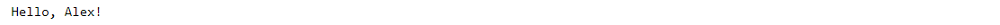



### Key takeaways

<table>
  <tr>
    <td>MustacheTemplate </td>
    <td>PIP.Services component used to construct and evaluate Mustache templates.</td>
  </tr>
  <tr>
    <td>Basic constructors</td>
    <td>Helpers used to construct more complex templates.</td>
  </tr>
  <tr>
    <td>template</td>
    <td>MustacheTemplate ‘s property used to create templates.</td>
  </tr>
  <tr>
    <td>evaluate</td>
    <td>MustacheTemplate ‘s method used to validate Mustache templates.</td>
  </tr>
 </table>

### Introduction

PIP.Services offers an implementation of a Mustache engine available in its Expressions module. This implementation of Mustache is enhanced with the addition of some helpers. In this tutorial, you will learn how to use the MustacheTemplate component, which can be used to evaluate Mustache templates. First, we will see its pre-requisites, then, we will learn some basic constructions supported by the component. Finally, we will see some examples of its usage.

### Pre-requisites
In order to use the Mustache template library, we must first install the Expressions module by running the following command:


  Not available 



  Not available



  Not available



  Not available  



  



  Not available  


### Managing Mustache templates

PIP.Services uses a set of basic constructions to create Mustache-like templates. In this section, we will learn how to use them to build and evaluate different templates.

#### Basic constructions

The library supports the following injections and conditional blocks:

<table>
  <tr>
    <td>Variable</td>
    <td>{{{NAME}}}</td>
  </tr>
  <tr>
    <td>Conditional (if)</td>
    <td>{{ #if VARIABLE }}Some value or {{{VARIABLE2}}} {{/if}}</td>
  </tr>
  <tr>
    <td>Conditional negation (if – else)</td>
    <td>{{{#unless VARIABLE}}} Some value or {{{VARIABLE}}} {{{/unless}}}</td>
  </tr>
  <tr>
    <td>If-else equivalent</td>
    <td>{{ #if VARIABLE }} Some value or {{{VARIABLE}}} {{/if}}{{{^VARIABLE}}} Some value or {{{VARIABLE}}} {{{/VARIABLE}}}</td>
  </tr>
</table>

#### Pre-requisites

To use Mustache templates, we must import the **MustacheTemplate** class. The following command shows how to do this:


  Not available 



  Not available



  Not available



  Not available  



  



  Not available  


#### Examples

Below are some examples of evaluations:

##### a)	Variable

Variables that have a dictionary structure can be used to validate a template. The following example shows how to use the evaluate_with_variables method.


  Not available 



  Not available



  Not available



  Not available  



  



  Not available  


Which produces the following output:

##### b)	Conditional

To create a conditional template, we use the #if helper. An example of its usage will be a template that creates the message “Hello, (Name)”. The variable used has two fields namely name and exclamation. The last one represents a Boolean value which if it is set to true, the message will show an added exclamation mark. 

**Note**: In general, any value that is interpreted by a specific language as false when the "If" operator is executed will be interpreted as false. Otherwise, it is considered true. For example, in Python, false values are None, False, 0, and ‘’. Node.js adds an empty list to them.

The following example shows how to create a conditional template:


  Not available 



  Not available



  Not available



  Not available  



  



  Not available  


After running the above code, we will see the following result:

