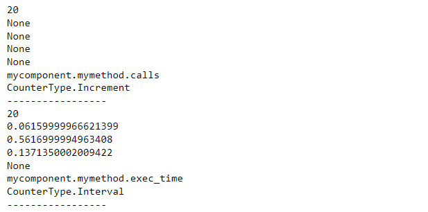
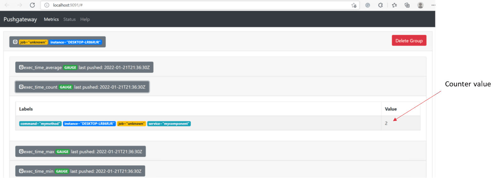



### Key takeaways

<table class="full-width-table">
  <tr>
    <td>PrometheusCounters</td>
    <td>Component used to create different metrics or counters.</td>
  </tr>
  <tr>
    <td>PrometheusMetricsService</td>
    <td>Component used to send metrics to /metrics.</td>
  </tr>
  <tr>
    <td>increment</td>
    <td>Method used to create a counter that increases according to a given number.</td>
  </tr>
  <tr>
    <td>incrementOne</td>
    <td>Method used to create a counter that increases by one.</td>
  </tr>
  <tr>
    <td>timestamp</td>
    <td>Method used to create a counter with the timestamp format.</td>
  </tr>
  <tr>
    <td>timestampNow</td>
    <td>Method used to create a counter that stores the current date and time in a timestamp format.</td>
  </tr>
  <tr>
    <td>beginTiming and endTiming</td>
    <td>Method used to create a counter that measures an interval of time, such as execution time.</td>
  </tr>
  <tr>
    <td>dump</td>
    <td>Method used to store obtained metrics.</td>
  </tr>
  <tr>
    <td>setInterval</td>
    <td>Method used to set the interval for dumps.</td>
  </tr>
</table>

### Introduction

In this tutorial, you will learn how to send different metrics to Prometheus. First, we will see how to do this via the Pushgateway. Then, we will understand how to show our metrics on a /metrics page. Finally, we will go through a set of different methods, which are useful to create different counters.

### Sending metrics to Pushgateway

One of the options presented by Prometheus is to send metrics directly to its Pushgateway interface. For this, Pip.Services has the PrometheusCounters component, which allows us to define different types of counters and send their values to it. The following sections explain how to do this.

#### Pre-requisites

In order to send our counters to Prometheus, we need to import the PrometheusCounters component. The following command shows how to do this.


    Not available  



    Not available  



   Not available  



  Not available



  



  Not available  


#### Adding the counter to our component

Once we have imported our component, we can create a class containing one or more counters. In our example, we create a class named “MyComponent”, which contains a method called “mymethod”. Within this method, we include two metrics. One is a counter that measures the number of calls to this method, and the other is a variable that measures execution time.


    Not available  



    Not available  



   Not available  



  Not available



  



  Not available  


#### Defining and connecting the counter

Once we have our component with the necessary counters, we create an instance of it and connect this object to Prometheus. To do this, we use the configure() method to provide the connection information and the open() method to connect it.


    Not available  



    Not available  



   Not available  



  Not available



  



  Not available  


#### Calling the method 

Now that we are connected, we can call “mymethod” one or more times. In the example below, we call it twice. 


    Not available  



    Not available  



   Not available  



  Not available



  



  Not available  


#### Results on console

And, after running our code we get the following messages on our console:

#### Obtaining and analyzing the results

We can get the counters with the getAll() method, which returns a list containing all the counters used.


    Not available  



    Not available  



   Not available  



  Not available



  



  Not available  


Once we have our list of counters, we can obtain some information from them via the count, min, max, average, time, name and type methods. The following example shows how to obtain these values 


    Not available  



    Not available  



   Not available  



  Not available



  



  Not available  


Which after running presents the following values for the previously defined metrics:

#### Pushgateway results

If we are connected to the Prometheus’ Pushgateway, we will find our metrics reflected in its interface. Thus, for example, in the image below, we can see the counter value of two, which indicates that the method was called twice, as we did before in our code.

#### Closing counters

Finally, to finish our code, we close the counters object to free resources.


    Not available  



    Not available  



   Not available  



  Not available



  



  Not available  


### Sending metrics to /metrics

Another option presented by Prometheus is to store the metric values on a page located at /metrics. For this purpose, Pip.Services offers the PrometheusMetricsService. Its use is explained in the following sections.

#### Pre-requisites

In order to use the PrometheusMetricsService component, we need to import it first. This can be done with the following command:


    Not available  



    Not available  



   Not available  



  Not available



  



  Not available  


#### Creating the component and the counters
As we did in the previous example, to send metrics to Prometheus, we need to create a component that generates these metrics first. We also need to create and configure a PrometheusCounters object. The following code shows how to do this:


    Not available  



    Not available  



   Not available  



  Not available



  



  Not available  


#### Creating the service

To create the /metrics page, we need to create an instance of the PrometheusMetricsService component and configure it. In the following example, we specify that our /metrics page will be located on our machine and connected via port 8080. We also say that this page will show the results obtained from the counters object. Our code is as follows:


    Not available  



    Not available  



   Not available  



  Not available



  



  Not available  


#### Setting the references

To relate the service and the counters, we need to set the references for the contextInfo, counters and service objects. This is done with the following code:


    Not available  



    Not available  



   Not available  



  Not available



  



  Not available  


#### Connecting and calling the method

Now, as we did in the previous example, we connect to Prometheus and call the method twice. In this case, we need to connect both, the counters and service objects. Then, we call mymethod() with a loop. The code is as follows:


    Not available  



    Not available  



   Not available  



  Not available



  



  Not available  


#### Closing the resources

Finally, we can free resources by closing both, the counters and service objects.


    Not available  



    Not available  



   Not available  



  Not available



  



  Not available  


#### /metrics results

The figure below shows the /metrics page containing the example’s counters and their values.

#### Complete code

Below is the complete code for the example.


    Not available  



    Not available  



   Not available  



  Not available



  



  Not available  


### Main counter methods

Most methods available from the PrometheusCounters component are inherited from its parent class CachedCounters. This section explains the most relevant ones.

#### increment

This method can be used to create a counter that increments by a specified value. Its syntax is

__increment(name: str, value: float)__

where name is the name of the counter and value is the increment number.

An example of its implementation is 


    Not available  



    Not available  



   Not available  



  Not available



  



  Not available  


where we create a counter named “mycomponent.mymethod.calls1” that increases by two every time it is called.

#### incrementOne

This method is similar to the previous one, but uses a fixed increment value of one. Its syntax is

__increment_one(name: str)__

where name represents the name of the counter.

For example, we can create a counter called “mycomponent.mymethod.calls2” that increases by one every time it is called:


    Not available  



    Not available  



   Not available  



  Not available



  



  Not available  


#### timestamp

This method records a given timestamp. Its syntax is:

__timestamp(name: str, value: datetime.datetime)__

where name is the name of the counter and value is the given timestamp. 

In the example below, we use this command to create a metric that measures the difference between the current time and a base time. 


    Not available  



    Not available  



   Not available  



  Not available



  



  Not available  


#### timestampNow

Similar to the previous one, this method records the current time as a timestamp. Its syntax is

_timestamp_now(name: str)__

where name is the name of the counter.

Using it, the example below shows how to create a metric that measures the current time:


    Not available  



    Not available  



   Not available  



  Not available



  



  Not available  


#### beginTiming and endTiming

The beginTiming() method starts the measurement of an execution time interval. It returns a CounterTiming object, which by calling the endTiming() method ends the measurement and updates the counter. Their syntaxes are

__beginTiming(name: str): CounterTiming__

and 

__end_timing()__

#### dump

This method saves the current values of counters. Its syntax is 

__dump()__

The following example shows how to create a timing for a method named mymethod. Here, we measure the execution time of a task, and then, we save the value with the dump() method.


    Not available  



    Not available  



   Not available  



  Not available



  



  Not available  


### setInterval

This method sets the time interval for the dump() method. Its syntax is 

__set_interval(value: float)__

where value is the time interval in milliseconds.

In the example below, we use this command to set the interval to one minute.


    Not available  



    Not available  



   Not available  



  Not available



  



  Not available  


### Wrapping up

In this tutorial, we have learned how to send metric values to Prometheus. First, we saw how to send them to Prometheus’ Pushgateway and analyze the results. Then, we learned how to present our metrics on a page under /metrics. Finally, we explored the main methods available for counters.
