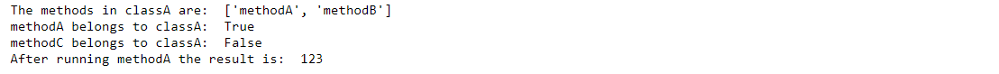
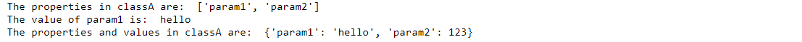
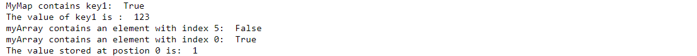
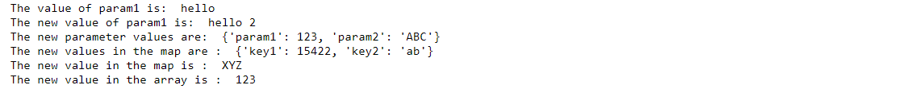

### Key takeaways

### Introduction
In this tutorial, you will learn how to use the Reflect package. This package provides different classes that will allow you to develop code with introspection capacity. We will start by briefly describing reflection. Then, we will learn how to use each of the different components provided in the package through the use of examples.

### What is reflection?
Reflection is a feature available in PIP. Services through its Reflect package. It allows a running microservice to examine and manage its internal properties. For example, given a class, it helps us to obtain the names of all its methods or the values of its parameters. 
In order to understand this package, we will go through its main classes and explain how they work.

### The Reflect package

This package belongs to the commons module and contains several classes used to examine objects dynamically.

#### a)	MethodReflector

The MethodReflector class allows us to examine an object’s methods and to execute them dynamically. The get_method_names method returns a list with all the methods in a class. The has_method method returns a boolean indicating whether or not a method belongs to a class. And, the invoke_method provides a way to invoke the execution of a method at runtime. The example below shows how to obtain the names of all methods in an object, find out if a method belongs to that object, and invoke its execution.

	

	  <button type="button" class="btn lang-select-btn">Node</button>
	  <button type="button" class="btn lang-select-btn">.NET</button>
	  <button type="button" class="btn lang-select-btn">Golang</button>
	  <button type="button" class="btn lang-select-btn">Dart</button>
	  <button type="button" class="btn lang-select-btn">Python</button>
	  <button type="button" class="btn lang-select-btn">Java</button>
	

  Not available 

  Not available  

  Not available  

  Not available   

  

  Not available  

After running the above code, we will get the following output:

#### b)	ObjectReader
This class helps us to investigate the properties of an object. Its get_property_names method returns a list of the properties in a class. The get_property method is used to obtain the value of a property, and the get_properties method reads the properties of an object and returns a map (dictionary) with their names and values. The code below shows examples of their usage.
	

	

	  <button type="button" class="btn lang-select-btn">Node</button>
	  <button type="button" class="btn lang-select-btn">.NET</button>
	  <button type="button" class="btn lang-select-btn">Golang</button>
	  <button type="button" class="btn lang-select-btn">Dart</button>
	  <button type="button" class="btn lang-select-btn">Python</button>
	  <button type="button" class="btn lang-select-btn">Java</button>
	

  Not available 

  Not available  

  Not available  

  Not available   

  

  Not available  

	
Once the code above is executed, we will get the following result:

The methods in this component can also be used with maps and arrays to find out if they contain certain elements and their values.

	

	  <button type="button" class="btn lang-select-btn">Node</button>
	  <button type="button" class="btn lang-select-btn">.NET</button>
	  <button type="button" class="btn lang-select-btn">Golang</button>
	  <button type="button" class="btn lang-select-btn">Dart</button>
	  <button type="button" class="btn lang-select-btn">Python</button>
	  <button type="button" class="btn lang-select-btn">Java</button>
	

  Not available 

  Not available  

  Not available  

  Not available   

  

  Not available  

	

#### c)	ObjectWriter

This component helps us to dynamically set the properties of an object. Its set_property method can be used to set the value of the property of an object at runtime. Similarly, the set_propeties method allows us to set the values of some or all the properties of an object with an input defined as a map. These methods can also be used with common objects such as maps and arrays.

	

	  <button type="button" class="btn lang-select-btn">Node</button>
	  <button type="button" class="btn lang-select-btn">.NET</button>
	  <button type="button" class="btn lang-select-btn">Golang</button>
	  <button type="button" class="btn lang-select-btn">Dart</button>
	  <button type="button" class="btn lang-select-btn">Python</button>
	  <button type="button" class="btn lang-select-btn">Java</button>
	

  Not available 

  Not available  

  Not available  

  Not available   

  

  Not available  

After running the above code, we will get the following result:
	

	
#### d)	PropertyReflector

This class allows us to examine an object’s properties and to dynamically get and set their values. The get_property_names is used to obtain a list containing all the properties of an object. The has_property   method allows us to find out whether an object has a property or not. The get_properties method obtains all the properties of an object and their values and places the result in the form of a dictionary. And, the set_property method is used to set the value of an object’s property. The code below provides examples of these methods.

	
