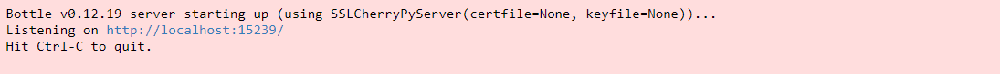



### Key takeaways

<table class="full-width-table">
  <tr>
    <td>JRestService </td>
    <td>Component available in the RPC module, services library. This component is used to create REST services that receive remote calls via the HTTP/REST protocol.</td>
  </tr>
  <tr>
    <td>Bottle</td>
    <td>Framework used to obtain request parameters.</td>
  </tr>
  <tr>
</table>

### Introduction

This tutorial will help you understand how REST services can be created with Pip.Services. It begins by explaining the necessary pre-requisites. Then, it proceeds to explain how to create a simple REST service using the RestService component, how to configure it, and how to run it. It ends by showing the results on a browser.

### Creating our REST service

#### Pre-requisites

In order to create our REST service, we need to import the RestService class, which is available in the services library, RPC module. This can be done with the following command:


   Not available  



   Not available  



   Not available  



   Not available  



  



  Not available  


Additionally, we will need to import [Bottle](https://bottlepy.org/docs/dev/), which will be used to access our requests.  


   Not available  



   Not available  



   Not available  



   Not available  



  



  Not available  


#### REST Service

First, we need to create our REST service. For this, we will create a class that inherits the Pip. Services’ component RestService, which has different methods that can be used to handle REST services. The most important one is configure, and we will use it to set up our microservice.

In this class, we first define a method to be used as a handler. In it, we define the parameters that are obtained via a Bottle request. In our example, this method is called my_page and the parameters are name and message.

We also define the register() method to register the service route. We use the GET method, and as we are not using a schema, we define it as None.

The first part of our code will look something like this:


   Not available  



   Not available  



   Not available  



   Not available  



  



  Not available  
  

#### Configuration

Now that we have our REST service defined, we will configure and run it. To configure our component, we first need to create an instance of our class and use the method configure to set up our connection protocol, host and port. As the configure method requires a ConfigParams input type, we import this class and use its method “from_tuples” to define our configuration. 

Lastly, we open our component. The second part of our code will look something like this:


   Not available  



   Not available  



   Not available  



   Not available  



  



  Not available  
 

#### Our microservice

Finally, our code will be:


   Not available  



   Not available  



   Not available  



   Not available  



  



  Not available  


### Running our REST service

With our REST service complete, we can now proceed to run it. The first thing that we will see is a message from Bottle indicating that our service is running and where it is listening from.

To see the result of our code, we use the following URL:


   Not available  



   Not available  



   Not available  



   Not available  



  



  Not available  


Which should display "Hello John" on our browser

### Wrapping up

In this tutorial, we have seen how to create a simple REST service using the RestService component available in the Pip.Services toolkit, RPC module, services library. First, we created our service class. Then, we configured and run it. Finally, the result was shown as a page on our browser. 

