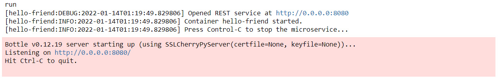


### Key takeaways
### Introduction

In this tutorial, you will learn how to generate Swagger documentation for a REST service. We will see three different cases. The first is a common REST service, which is documented via a YAML file containing a description of its methods. The second is a commandable REST service, which has a defined set of commands that is used to define the Swagger document. Finally, the last case considers a commandable REST component with a command set and a Swagger UI defined by a YAML file. 

### Swagger document generation

Pip.Services offers two types of REST services, which are defined by two different classes. The first is an ordinary REST service and is defined in the RestService component. The second is a REST service that contains a set of predefined commands (or methods) that can be called from other services and is defined by the CommandableHttpService class. 

As such, they represent two different approaches when it comes to Swagger documentation: A REST service needs a YAML file that describes its UI in order to generate its documentation, whereas a commandable service allows for automatic generation via a description of the command set or via a YAML file if the path to it is included in the configuration file. Moreover, it should be noted that an automatically-generated description always considers an HTTP method as POST.

To explain these cases, we will create an app that given a name returns the phrase “Hello {name}” by calling a method named greeting. In this app, we will include the necessary elements to create a Swagger UI that documents this method. The following sections teach the steps to achieve this goal.

#### Pre-requisites

First of all, to create the Swagger UI, we need to install the swagger module. This can be done with the following command:


   Not available 



    Not available 



   Not available 



   Not available 



  



  Not available  


#### Document 1: REST service

In this case, we want to document the greeting method as part of a REST service. For this, we need to define a YAML file containing the information necessary to create the Swagger UI. 

##### Service

Our REST service is called HelloFriendService. It is defined by a class that inherits from the RestService component and has a method named greetings, which given a name, returns “Hello {name}” on a web page. 

It also contains a reference to the controller and a method named register that defines the necessary elements for the Swagger UI. Its code is as follows:


   Not available 



    Not available 



   Not available 



   Not available 



  



  Not available  


##### Configuration example

As we will use a process container to run the example, we need to describe this service in the configuration file. In this description, we set the Swagger’s enable field to true to specify that we want to generate a Swagger UI for the service, and we define the path to our YAML file containing the Swagger UI description.


   Not available 



    Not available 



   Not available 



   Not available 



  



  Not available  


##### Swagger YAML file

Now, we create a YAML file that will be used by Swagger to define the UI. In our case, the service has the greeting method only, which we consider of type GET. An example of this file is:


   Not available 



    Not available 



   Not available 



   Not available 



  



  Not available  


#### Documents 2 & 3: Commandable REST service

These two cases document the same commandable REST service. The difference between them is that the first automatically generates the Swagger UI based on a command set, and the second uses a YAML file.

##### Command set

To create a command set, we extend the CommandSet class and define our greeting command in it. The code below illustrates how to do this:


   Not available 



    Not available 



   Not available 



   Not available 



  



  Not available  


##### Service for document 2

Once our command set has been defined, we create our commandable REST service by extending the CommandableHttpService class and we link it to our controller. This service checks for a YAML file in the configuration file. If not found, it builds the Swagger UI from the command set. In our example, the configuration file doesn’t include a path to a YAML file, and the Swagger UI is generated from the command set previously defined.


   Not available 



    Not available 



   Not available 



   Not available 



  



  Not available  


##### Configuration for document 2

To be able to generate a Swagger UI, we need to set the swagger’s enable field to true. Besides, as we want to document the commands defined in the command set, we declare auto as true and we define the route field that will be part of the URL for the generated Swagger UI. The example below shows this configuration.


   Not available 



    Not available 



   Not available 



   Not available 



  



  Not available  


##### Service for document 3

Similar to the previous one, this service builds the Swagger UI from the YAML file defined in the configuration file.


   Not available 



    Not available 



   Not available 



   Not available 



  



  Not available  


##### Configuration for document 3

We can also declare a path to a YAML file containing the description for the Swagger UI. In this case, even though we have declared auto as true, as the configuration contains a path to a YAML file, the system will choose this file over the automatic generation.


   Not available 



    Not available 



   Not available 



   Not available 



  



  Not available  


##### Swagger yam file

For document 3, we use the YAML file below to describe the UI. As we can see, the main difference with the previous one is that we declare the HTTP method as POST instead of GET, and therefore, we define the requestBody as required.


   Not available 



    Not available 



   Not available 



   Not available 



  



  Not available  


#### Containerization

Now that our REST services are defined, we want to create a process container to run them. For this, we need to define our factory of components and a class extending ProcessContainer. The following sections explain how to do this.

##### Factory

To create our factory of components, we extend the Factory class and register our REST and commandable REST services. 


   Not available 



    Not available 



   Not available 



   Not available 



  



  Not available  


##### Process container

Once we have our factory, we define our process container by extending the ProcessContainer class and adding the factories for the services and Swagger. Our code will look something like this:


   Not available 



    Not available 



   Not available 



   Not available 



  



  Not available  


#### Runner

Once our components are defined, we can run our app by invoking the run method from our process container.


   Not available 



    Not available 



   Not available 



   Not available 



  



  Not available  


And, after executing our code, we will see the following messages on our console:

### Results

To see the generated Swagger UIs, we can use the following URL:

[http://localhost:8080/swagger/index.html ]()

#### General Interface

The generated Swagger UI presents a drop-down menu that can be used to select any of the cases defined in this exercise.

#### Document 1: REST service

If we select the hello_friend option, we will see a UI that presents all the information defined in the Swagger YAML file.

#### Document 2: Commandable REST service

Alternatively, if we choose the commandable_hello_friend1 option, we will be presented by a UI showing the information automatically generated from the command set.

#### Document 3: Commandable REST service.

If we select commandable_hello_friend2, we get a similar UI but generated from our YAML file.

### Final code

In this section, we show the complete code and the corresponding configuration YAML file.

#### Application


   Not available 



    Not available 



   Not available 



   Not available 



  ##### grpc.py

  
  
  



  Not available  


#### Configuration YAML file


   Not available 



    Not available 



   Not available 



   Not available 



  ##### config.yaml

  
  
  



  Not available  


### Wrapping up

In this tutorial, we have seen how to create Swagger UIs from a REST service and a commandable REST service. First, we created a REST service that is Swagger enabled and obtained all the information necessary to create the UI from a YAML file. After that, we created a commandable REST service, which developed a UI from a set of commands or a YAML file. Finally, we created a process container used to run our app. Once run, our app produced Swagger UIs documenting the greeting method for each case.
