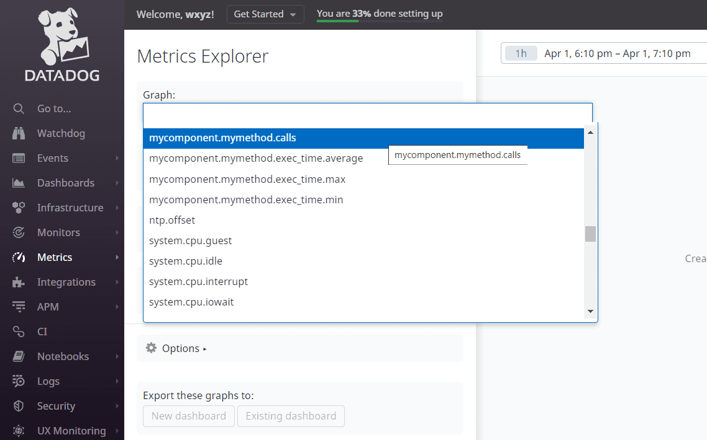



### Key takeaways

<table class="full-width-table">
  <tr>
    <td>Datadog application</td>
    <td>Online application used to monitor metrics, traces, and logs.</td>
  </tr>
  <tr>
    <td>DataDogCounters</td>
    <td>Component used to send metrics to the Datadog application.</td>
  </tr>
  <tr>
    <td>DataDogLogger</td>
    <td>Component used to send logs to the Datadog application.</td>
  </tr>
</table>

### Introduction

In this tutorial, you will learn how to send different metrics and logs to Datadog. For this, we will first create a class with a method that, once executed, sends metrics to Datadog via the DataDogCounters component. Then, we will modify this class and use it to send log information to Datadog via the DataDogLogger class.

### DataDogCounters

The DataDogCounters class is used to send metrics to the Datadog application. This component inherits its methods from the CachedCounters class, which, in turn, implements the ICounters interface. It communicates with Datadog via the DataDogMetricsClient, which is a REST component.

#### Pre-requisites

In order to use this component, we must first import it. To do this, we can use the following command:


   



   



     



  Not available  



  



  Not available  


#### Creating a component with metrics

Our next step is to create a component that contains some metrics. For this, we create a class that contains a method that prints a greeting message. Within this class, we create two counters: one that increments by one each time the method is executed and one that measures execution time. The following code shows how this class is constructed:


   



   



     



  Not available  



  



  Not available  


#### Creating a DataDogCounters object

Now, we create a DataDogCounters object and connect it to the Datadog application. This object only requires the API key as a configuration parameter. The code below shows how to do it.


   



   



     



  Not available  



  



  Not available  


#### Generating values for the metrics

Once we have our components ready, we can generate some values for our metrics by running the component's method. In the example below, we create an instance of the object and run "mymethod" five times.


   



   



     



  Not available  



  



  Not available  


After running it, we obtain the following output:

#### Our metrics in Datadog

In order to verify that our program sent the credentials to Datadog, we can go to its site and we will see that the metrics appear on the list in the Metrics Explorer section. 

#### Final code

We can now improve our component by adding some interfaces and functionality commonly associated with Pip.Services. The code below shows the result.


   



   



     



  Not available  



  



  Not available  


### DataDogLogger

The DataDogLogger class is used to capture log messages and send them to the Datadog application. This component extends the CachedCounters class and uses the REST client DataDogLogClient to send the logs to Datadog.

#### Pre-requisites

To use this component, we need to import it first. The following command shows how to do this:


   



   



     



  Not available  



  



  Not available  


#### Creating a component with logging

Next, we modify our previous component by changing the print statements to log statements of type DataDogLogger. The following code shows how to do this:


   



   



     



  Not available  



  



  Not available  


#### Creating a DataDogLogger object

Once we have our component ready, we create an instance of DataDogLogger and configure it with our access key. The following code shows how to do this.


   



   



     



  Not available  



  



  Not available  


#### Generating logs

To generate logs and send them to the Datadog application, we need to create an instance of our component and run "mymethod". The following code shows how to do it by using a loop whereby we run the method five times.


   



   



     



  Not available  



  



  Not available  


After running this code, we obtain the following output:

#### Our logs in Datadog

After running our program, we can see the logs on the Datadog application screen. The following figure shows these results:

#### Final code

Now we can re-arrange our code to create a component according to Pip.Services practices. For this, we add the IConfigurable and IOpenable interfaces, and the configure, open and close methods. We also define the DataDogLogger component within the class, and use the configure, open and close methods to perform these operations on our DataDogLogger component. The following code shows how this can be done:


   



   



     



  Not available  



  



  Not available  


### Wrapping up

In this tutorial, you have learned how to send metrics and logs to Datadog. First, we saw how to work with the DataDogCounters component. By using this class, we constructed two different counters: one that measures the number of times a method is executed, and another that measures execution time. Then, we executed this class and saw that the values were received by the Datadog application.

Next, we learned about the DataDogLogger class, which we used to send log information to the Datadog application by modifying our previous example. After executing the example's method, we verified that the logs had been received by the Datadog application.

Finally, for both cases, we presented a final version of the code with some improvements that considered common aspects of Pip.Services programming.

