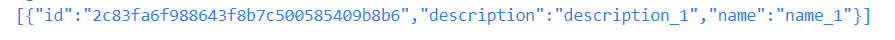



### Key takeaways

<table class="full-width-table">
  <tr>
    <td>CassandraPersistence</td>
    <td>Component used to perform CRUD operations on data objects stored in a Cassandra database.</td>
  </tr>
   <tr>
    <td>IdentifiableCassandraPersistence</td>
    <td>Component used to perform CRUD operations on identifiable data objects stored in a Cassandra database.</td>
  </tr>
  <tr>
    <td>Identifiable data object</td>
    <td>Data object that contains a field named id with unique values that can be used to identify the object.</td>
  </tr>
</table>

### Introduction

In this tutorial, you will learn how to interact with Cassandra. First, we will see how to install the Cassandra module. Then, we will see how to perform CRUD operations with the CassandraPersistence and IdentifiableCassandraPersistence components. Finally, in the wrapping up section, we will review the concepts learned.

### Cassandra persistence

Pip.Services contains the Cassandra module, which has several components that can be used to interact with Cassandra. In the following sections, we will learn two of them namely, CassandraPersistence and IdentifiableCassandraPersistence. As the names suggest, the main difference between them is the type of data objects handled. While the first component can be used with any type of data object, the second requires that the data object is identifiable (contains an id field).

#### General pre-requisites

In order to use this module, we must first install it. The following command shows how to do this:


  



  Not available  



  Not available  



  Not available  



  Not available  



  Not available  


#### Data object

The first thing that we need to do is to create a data object. To be able to have a common object for both components, we consider a structure with an id (identification) field. However, we should notice that this field is not required by the CassandraPersistence class. In addition, we add two fields to our example: name and description. The following code shows this data structure:


  



  Not available  



  Not available  



  Not available  



  Not available  



  Not available  


#### CassandraPersistence

This is the most basic persistence component in this module. It contains the necessary methods to perform basic CRUD operations. The next sections explain each of them. 

##### Pre-requisites

To be able to use this component, we need to import it first. The following command shows how to perform this task:


  



  Not available  



  Not available  



  Not available  



  Not available  



  Not available  


##### Component implementation

Now, we can create a custom component as a subclass of CassandraPerformance. Within our class, we also define two protected methods. The first, named "defineSchema", creates a table used to store our data. The second method adapts a FilterParams object to the specific needs of Cassandra. Later in this tutorial, we will see how to define other methods for CRUD operations that must also be included in our class. The code below is an example of this class:


  



  Not available  



  Not available  



  Not available  



  Not available  



  Not available  


##### Connection

After creating our persistence object, we need to connect to Cassandra. For this, we create an instance of our persistence component and use the configure() method to specify the necessary connection parameters. Then, via the open() method, we connect to Cassandra. In our example, we consider a local database and port 9042. We also specify our credentials. The code is as follows:


  



  Not available  



  Not available  



  Not available  



  Not available  



  Not available  


We must also remember to free resources once our operations have been executed. This is done with the close() method. The following code shows how to use it:


  



  Not available  



  Not available  



  Not available  



  Not available  



  Not available  


##### CRUD operations

Once we have our persistence component ready, we can start performing CRUD operations. The following sections explain how to use the different methods available in this class. 

###### Create

First, we create data objects for our examples. The code below creates two different objects named item1 and item2 respectively:


  



  Not available  



  Not available  



  Not available  



  Not available  



  Not available  


Then, we store these objects in our database with the create() method. This method requires the correlation_id and a data object as inputs. The following code shows how to use it:


  



  Not available  



  Not available  



  Not available  



  Not available  



  Not available  


After running the previous code, we obtain the following values for result1 and result2 respectively:

###### Read
 
To read a record from our database, we have several methods. 
 
**getPageByFilter()**

This is a private method. Thus, we need to create our public version of it and use the filterCondition() method to adapt our FilterParams object to Cassandra. The code below shows how to define this method and how to call it from our persistence object:


  



  Not available  



  Not available  



  Not available  



  Not available  



  Not available  


Which, after running, returns the following record:

**getOneRandom()**

This method extracts a random record according to a given condition. As this method is private, we need to first define it in our custom component and then call it from our persistence object. We also need to use the filterCondition() method to adapt our filter to Cassandra. The following code shows how to do this:


  



  Not available  



  Not available  



  Not available  



  Not available  



  Not available  


After running the above code, we get a result similar to the following record:

**getCountByFilter()**

This method returns the number of stored records according to a given condition. Once again, as this is a private method, we need to define it in our class and call it from our persistence object. Similar to the previous method, we also need to use the filterCondition() method to adapt to Cassandra. The code below illustrates its usage:


  



  Not available  



  Not available  



  Not available  



  Not available  



  Not available  


Which, after running, provides the following result:

###### Update

This component has no specific update() method.

###### Delete

To delete a record, this class provides the deleteByFilter() method, which is private and deletes one or more records according to a given filter. This method returns no result. In order to use it, we need to consider two points: first, we have to remember that Cassandra only allows for the deletion of records specified by their primary key (in our case the id field). Second, as this is a private method, we need to define our public version and then run it from our class instance. The following code shows how to do this:


  



  Not available  



  Not available  



  Not available  



  Not available  



  Not available  


##### Final code

Now, we can assemble everything together and obtain the following program:


  



  Not available  



  Not available  



  Not available  



  Not available  



  Not available  


#### IdentifiableCassandraPersistence

This component is a subclass of the previous one and, as such, it inherits all its methods. The main difference between them is that this component requires an identifiable data object, that is, an object that contains a parameter named id whose value uniquely identifies it. The following sections explain the main CRUD methods contained in this class.

##### Pre-requisites

In order to use this component, we need to import it first. The following command shows how to do this:


  



  Not available  



  Not available  



  Not available  



  Not available  



  Not available  


##### Component implementation

As we did with the previous class, we create a custom persistence component that inherits this class. In it, we also code a defineSchema() method that is used to create a table in the database. If we want to use the methods of the previous class, we need to define a filterCondition() method as we did before. In the examples below, we only consider the methods in this class, which don't require filters. The code below shows an example of this custom component:


  



  Not available  



  Not available  



  Not available  



  Not available  



  Not available  


##### Connection
Once we have our component ready, we create an instance of it and define our connection to the database via the configure() method. Then, we connect to Cassandra via the open() method. The following code shows how to do this:


  



  Not available  



  Not available  



  Not available  



  Not available  



  Not available  


And, after using our component, we free resources with the close() method:


  



  Not available  



  Not available  



  Not available  



  Not available  



  Not available  


##### CRUD operations
This component offers a set of methods for CRUD operations that are based on identifiable objects. The following sections show how to use the main ones.

###### Create

As we did with the previous component, we need to create some data objects first. The procedure is identical to what we saw before:


  



  Not available  



  Not available  



  Not available  



  Not available  



  Not available  


Where the value of item is:

And


  



  Not available  



  Not available  



  Not available  



  Not available  



  Not available  


Where item has the following value:

###### Read

This component adds two methods that can be used to read records. 

**getOneById()**

This method extracts one record according to a given id value. The following example shows how to use it:


  



  Not available  



  Not available  



  Not available  



  Not available  



  Not available  


Where item has the following value:

**getListByIds()**

This method can be used to extract one or more records. It accepts a list of ids as an input and returns a list containing the extracted records. The example below explains its usage:


  



  Not available  



  Not available  



  Not available  



  Not available  



  Not available  


Where itemList has the following value:

###### Update

This component offers three methods to update a record.

**update()**

This method accepts a data item as input and updates the record stored with the given id. The following lines of code show how to use it:


  



  Not available  



  Not available  



  Not available  



  Not available  



  Not available  


Where item has the following value:

**updatePartially()**

This method accepts an id and an AnyValueMap object with a field and a value as inputs and updates the specified field in the specified record. The following code exemplifies its usage:


  



  Not available  



  Not available  



  Not available  



  Not available  



  Not available  


Where item has the following value:

**set()**

Alternatively, we can use the set() method, which updates an existing record or creates a new one if the record was not found. The following code illustrates its use:


  



  Not available  



  Not available  



  Not available  



  Not available  



  Not available  


Where item has the following value:

###### Delete

This component adds two delete methods to its parent class.

**deleteById()**

This method accepts the correlation_id and a record's id as inputs and deletes the record identified by the given id. Once the record is deleted, this method returns the deleted record. The following example shows how to use it:


  



  Not available  



  Not available  



  Not available  



  Not available  



  Not available  


Where item has the following value:

**deleteByIds()**

If we want to delete more than one record, we can use this method. It accepts the correlation_id and a list containing the ids of the records to be deleted as inputs. This method doesn't return any value. The following example explains how to delete the records with ids equal to one and two:


  



  Not available  



  Not available  



  Not available  



  Not available  



  Not available  


##### Final code 

We can now combine the previous examples into one program that performs all the CRUD operations:


  



  Not available  



  Not available  



  Not available  



  Not available  



  Not available  


### Wrapping up

In this tutorial, we saw how to use the CassandraPersistence and IdentifiableCassandraPersistence components. The first accepts any type of data object, whereas the second requires that the data object is identifiable. 

We learned how to perform CRUD operations with both components. We also saw that as IdentifiableCassandraPersistence is a subclass of CassandraPersistance, it inherits all the methods of the former and adds several methods based on ids. We understood that many of the methods in the CassandraPersistence class are private, and thus require to be redefined in our custom component.

Finally, and for both components, we created a program that combines all the learned methods into one piece of code. 
