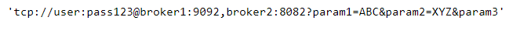


### Key takeaways

<table class="full-width-table">
  <tr>
    <td>composeUri</td>
    <td>Utility that creates a URI string from information stored in a ConfigParams object.</td>
  </tr>
  <tr>
    <td>concat</td>
    <td>Utility that merges two ConfigParams objects into one.</td>
  </tr>
  <tr>
    <td>exclude</td>
    <td>Utility that creates a new ConfigParams object based on a given one and a set of excluded fields.</td>
  </tr>
  <tr>
    <td>include</td>
    <td>Utility that creates a new ConfigParams object based on a given one and a set of included fields.</td>
  </tr>
  <tr>
    <td>parseURI</td>
    <td>Utility that obtains information from a URI and stores it in a ConfigParams object.</td>
  </tr>
</table>

### Introduction

In this tutorial, you will learn how to use a set of utilities offered by Pip.Services that can be used to simplify the handling of connections. We will start by explaining how to import these components. Then, we will see their syntax and how to use them. Finally, we will explore an example that illustrates the practical application of some of these utilities.

### Pre-conditions

In order to use these utilities, we need to import them first. The following command shows how to do this:


  



  Not available  



  



  Not available  



  



  Not available  


### Utility # 1: composeUri

The composeUri() method creates a URI based on the information given via a ConfigParams object. It also accepts default values for protocol and port, which are used when the ConfigParams object doesn't provide this information. 

The syntax of this command is

**composeUri(options: ConfigParams, default_protocol: str, default_port: int)**

And, the following example illustrates how to use it:


  



  Not available  



  



  Not available  



  



  Not available  


Which returns



### Utility # 2: concat

The concat() method merges the information from two ConfigParams objects into one. It also accepts a set of parameter names, which if specified, determine the parameters to be merged. 

Its syntax is

__concat(options1: ConfigParams, options2: ConfigParams, *keys: str)__

The example below shows how to merge the username and password only.


  



  Not available  



  



  Not available  



  



  Not available  


Where the merged object has the following structure:


### Utility # 3: exclude

The exclude() utility creates a new ConfigParams object that includes all the fields from a given one except for those specified as input parameters.

Its syntax is 

__exclude(options: ConfigParams, *keys: str)__

In the following example, we create a new ConfigParams object containing all the same fields as the original one with the exemption of username and password:


   



  Not available  



  



  Not available  



  



  Not available  


And, after running the above code, we obtain the following result:


### Utility # 4: include

The include() method creates a new ConfigParams object based on a given one and a set of fields to be included. 

The syntax is

__include(options: ConfigParams, *keys: str)__

For example, in the code below, a new object is created from an original one which includes the username and password only.


  



  Not available  



  



  Not available  



  



  Not available  


With the resulting object containing the following fields and values:


### Utility # 5: parse_uri

The parseURI() method obtains information from a URI string and stores it in a ConfigParams object. It accepts default values for protocol and port, which are included in the ConfigParams object in those cases that this information cannot be obtained from the URI string. 

Its syntax is

__parseUri(uri: str, default_protocol: str, default_port: str)__

The following example shows how this utility works:


   



  Not available  



  



  Not available  



  



  Not available  



And, this example illustrates how to use the default values:


  



  Not available  



  



  Not available  



  



  Not available  



### Practical example

The example below shows a practical application of two of these utilities, namely parseURL() and exclude(). In it, we create a MongoDB connector where these methods are used during configuration to consider two possibilities: a connection passed as a URI string and access to the database without the need for authorization.


  
  
  



  
  Not available  
  



  
   
  



  
  Not available  
  



  
    
  



  Not available  


### Wrapping up

In this tutorial, we have seen how to use a set of utilities offered in the Component module that facilitate the programming of connections. 

We learned that these utilities help us to compose a URI from a set of parameters stored in a ConfigParams object, merge two sets of configuration parameters, filter a ConfigParams object, and decompose a URI string.

In the end, we saw an example that illustrated the practical use of some of these utilities.
 
```python

```
