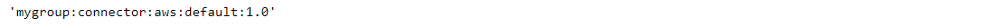



### Key takeaways

<table class="full-width-table">
  <tr>
    <td>Descriptor </td>
    <td>A component's locator, which is defined by its group, type, kind, name, and version.</td>
  </tr>
  <tr>
    <td>Scenarios</td>
    <td>Descriptors can define many scenarios such as, for example, a specific component or all persistence components for a certain microservice.</td>
  </tr>
</table>

### Introduction

This tutorial will help you understand what a descriptor is, how to create one, how to get its properties, how to check its completeness, how to convert it to a string, and how to compare it to other descriptors. Finally, it provides an example of its usage.

### What is a Descriptor?

Within the Pip.Services toolkit, a descriptor is a component's locator that is based on the component's group, type, kind, name, and version. The Descriptor class is part of the Commons module and is included in the Refer library. The figure below summarizes the different elements of a descriptor.

### Using Descriptors

#### a)	Pre-requisites

In order to create and use a descriptor, we first need to import this component. This can be done with the following command:


  Not available  



  Not available  



   



  Not available  



  



  Not available  


#### b)	Creating a descriptor

Descriptors can be created by defining an instance of the Descriptor class. The constructor of this class presents the following structure:

**Descriptor(group, type, kind, name, version)**,

where each field can contain a specific value, *, or None.

Based on this syntax, descriptors allow for the implementation of many different scenarios. Some examples are:


   Not available  



  Not available  



   



  Not available  



  



  Not available  


#### c)	Getting its properties

The values of an instance of a descriptor can be obtained via get_xxx() methods, where xxx stands for group, kind, name, or version respectively. The example below shows how to use each of them.


  Not available  



  Not available  



   



  Not available  



  



  Not available  


##### d)	Converting to string

A string version of a descriptor can be obtained via the to_string() method. The following example explains it.


  Not available  



  Not available  



   



  Not available  



  



  Not available  


#### e)	Checking its completeness

A descriptor is complete when all its fields have a specific value, that is, a value different from * or None. The method is_complete() can be used to check the completeness of a descriptor. It returns true if the descriptor is complete and false otherwise. The example below explains its usage.


  Not available  



  Not available  



   



  Not available  



  



  Not available  


#### f)	Comparing descriptors

There are three matching methods namely match, exact_match and equals. The first partially matches a descriptor to another descriptor. If any field contains * or None, this field will be excluded from the match. The second method matches two descriptors by all fields. Finally, the equals() method compares a descriptor to a value. If the value is a Descriptor, it tries to match them. Otherwise, the method returns false. The following example shows how to use them.


  Not available  



  Not available  



   



  Not available  



  



  Not available  


### Example of usage

Now that we know how to handle a descriptor, we will see an example of its application. 

### Adding a component to a factory

Factories are used to automate component creation. They work by registering components based on their descriptors. In the following example, we first define a custom component, then we register it in a factory previously created, and finally we create an instance of the class. The code is:


  Not available  



  Not available  



   



  Not available  



  



  Not available  


### Wrapping up

In this tutorial, we have learned that descriptors can be used to define components and groups of components. We have also seen how to obtain a descriptor's properties, check its completeness, convert it to a string, and compare it to other descriptors. Lastly, we saw an example of their usage by showing how to register a component to a factory.
