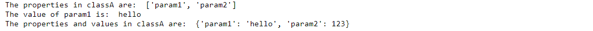



### Key takeaways

<table class="full-width-table">
  <tr>
    <td>Reflection</td>
    <td>The capacity of code to introspect.</td>
  </tr>
  <tr>
    <td>Reflect</td>
    <td>PIP.Services package with reflection functionality.</td>
  </tr>
  <tr>
    <td>MethodReflector</td>
    <td>Component used to examine an object's methods and to dynamically invoke them.</td>
  </tr>
  <tr>
    <td>ObjectReader</td>
    <td>Component used to examine the properties of an object and to dynamically read them.</td>
  </tr>
  <tr>
    <td>ObjectWriter</td>
    <td>Component used to dynamically set the properties of an object.</td>
  </tr>
  <tr>
    <td>PropertyReflector</td>
    <td>Component used to examine an object's properties and to dynamically get and set their values.</td>
  </tr>
  <tr>
    <td>RecursiveObjectReader</td>
    <td>Component used to examine the properties of an object and to dynamically read them recursively using "dot" notation.</td>
  </tr>
  <tr>
    <td>RecursiveObjectWriter</td>
    <td>Component used to dynamically set the properties of an object in a recursive way using "dot" notation.</td>
  </tr>
 </table>

    
### Introduction
In this tutorial, you will learn how to use the Reflect package. This package provides different classes that will allow you to develop code with introspection capacity. We will start by briefly describing reflection. Then, we will learn how to use each of the different components provided in the package through the use of examples.

### What is reflection?
Reflection is a feature available in PIP. Services through its Reflect package. It allows a running microservice to examine and manage its internal properties. For example, given a class, it helps us to obtain the names of all its methods or the values of its parameters. 
In order to understand this package, we will go through its main classes and explain how they work.

### The Reflect package

This package belongs to the commons module and contains several classes used to examine objects dynamically.

#### a)	MethodReflector

The MethodReflector class allows us to examine an object's methods and to execute them dynamically. The get_method_names method returns a list with all the methods in a class. The has_method method returns a boolean indicating whether or not a method belongs to a class. And, the invoke_method provides a way to invoke the execution of a method at runtime. The example below shows how to obtain the names of all methods in an object, find out if a method belongs to that object, and invoke its execution.


  Not available 



  Not available 



     



  Not available 



  



  Not available  


After running the above code, we will get the following output:

#### b)	ObjectReader
This class helps us to investigate the properties of an object. Its get_property_names method returns a list of the properties in a class. The get_property method is used to obtain the value of a property, and the get_properties method reads the properties of an object and returns a map (dictionary) with their names and values. The code below shows examples of their usage.


  Not available 



  Not available  



    



  Not available 



  



  Not available  

	
Once the code above is executed, we will get the following result:

The methods in this component can also be used with maps and arrays to find out if they contain certain elements and their values.


  Not available 



  Not available   



    



  Not available 



  



  Not available  


	

#### c)	ObjectWriter

This component helps us to dynamically set the properties of an object. Its set_property method can be used to set the value of the property of an object at runtime. Similarly, the set_propeties method allows us to set the values of some or all the properties of an object with an input defined as a map. These methods can also be used with common objects such as maps and arrays.


  Not available 



  Not available  



    



  Not available 



  



  Not available  


After running the above code, we will get the following result:
	

	
#### d)	PropertyReflector

This class allows us to examine an object's properties and to dynamically get and set their values. The get_property_names is used to obtain a list containing all the properties of an object. The has_property   method allows us to find out whether an object has a property or not. The get_properties method obtains all the properties of an object and their values and places the result in the form of a dictionary. And, the set_property method is used to set the value of an object's property. The code below provides examples of these methods.


  Not available 



  Not available  



    



  Not available 



  



  Not available  

	
After running the above code, we will get the following results.

#### e)	RecursiveObjectReader
This class helps us to examine the properties of an object and to dynamically read them using dot notation (object.subobject.property). The get_property_names gives a list containing all the properties in an object, and the has_property method returns a Boolean that indicates whether an object contains a property or not. The get_properties method provides us with a map containing all the properties of an object and their values, and the get_property method is used to obtain the value of a specific property. 

The example below shows how to use this component. As we can see from the results obtained, when we apply the get_properties method to my_classB, we also obtain the parameters inherited from my_classA and their values.


  Not available 



  Not available  



    



  Not available 



  



  Not available  

	

	
#### f)	RecursiveObjectWriter
This class is used to dynamically set the properties of an object recursively using dot notation. Its set_property method allows us to set the value of a property. The set_properties method is used to set the values of some or all the properties in an object and accepts a dictionary as input. The copy_properties method copies the properties of one object into another one. This code shows examples of their usage:


  Not available 



  Not available  



    



  Not available 



  



  Not available  

	
After running, this code produces the following output:

#### g)	TypeDescriptor
This class stores a reference to a type represented by the type name and library (module) where the type is defined. This class has three methods. The equals method compares a descriptor to a value. The get_library method gets the library or module of a descriptor.  The get_name method obtains the name of the object type. The to_string method returns a string representation of the descriptor with the format name[,library]. And, the static method from_string transforms a string into a Descriptor object. Below are some examples of these methods' usage.


  Not available 



  Not available 



    



  Not available 



  



  Not available  

	
The output from this code is:

#### h)	TypeMatcher
This class allows us to match values based on equality. The match_type method matches an expected value to an actual one. The match_type_by_name method matches an expected type to an actual type. The match_value_type and match_value_type_by_name methods match an expected type to a type of value. The following code shows examples of their usage.


  Not available 



  Not available 



    



  Not available 



  



  Not available  

	
After running this code, we will obtain the following results:
	

	
#### i)	TypeReflector
This class is used to examine the type of an object and create instances based on its type. Its create_instance_by_type method provides a way to create an instance of an object based on a type. The create_instance_by_descriptor method is similar to the previous one but uses a descriptor as input. 
The example below shows how to create an object of classA and verify that the values of its parameters are the ones defined in the class.


  Not available 



  Not available 



    



  Not available 



  



  Not available  

	
After running it, we get:

	
### Wrapping up
In this tutorial, we have learned what reflection is and how to use the Reflect library available in the PIP.Services toolkit, which provides several tools for class introspection. We have seen all its classes and examples of their main methods' usage. 
