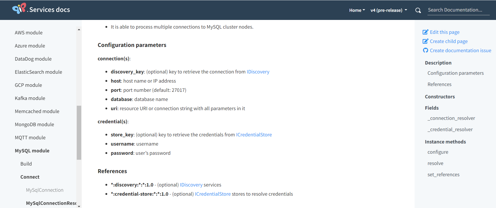

### Key takeaways

<table class="full-width-table">
  <tr>
    <td>General case</td>
    <td>In general, a configuration is composed of a descriptor and the component's configuration parameters.</td>
  </tr>
  <tr>
    <td>Configuration examples</td>
    <td>These examples show how to configure some of the most common components available in the PIP.Services toolkit.</td>
  </tr>
 </table>

### Introduction
In this tutorial you will learn how to create yml configuration files. First, we will see a general case. Then, we will show examples of the most common components in PIP.Services. These examples are valid for any of the six languages used by the toolkit.
### Syntax
In this section we will learn how to define the configuration for a component. First, we will see the general syntax. Then, we will show examples of different configurations for components already available in PIP.Services. These configurations are valid for any of the six languages supported by Pip.Services.
#### General case
In general, the syntax for the configuration of a component is:

```yml
- descriptor: "   "
parameter1: value1
...
parametern: valueN
```

Where the configuration parameters depend on the component considered, and can be obtained from the component's Configuration parameters section available in the reference manual.



Figure 1 – Example of a Configuration parameters section

### Configuration examples
The following sections show several configuration examples for the most common components available in the PIP.Services toolkit. They are presented in alphabetical order and serve as a guide that can be adapted to your specific needs.

#### CloudWatch

```yml
{{#if CLOUD_WATCH_ENABLED}}
# Cloudwatch counters
- descriptor: "pip-services:counters:cloudwatch:default:1.0"
  region: {{AWS_LAMDBA_ARN}}
  access_id: {{AWS_ACCESS_ID}}
  access_key: {{AWS_ACCESS_KEY}}

# Cloudwatch logger
- descriptor: "pip-services:logger:cloudwatch:default:1.0"
  level: "info"
  stream: {{CLOUD_WATCH_STREAM}}
  group: {{CLOUD_WATCH_GROUP}}
  region: {{AWS_LAMDBA_ARN}}
  access_id: {{AWS_ACCESS_ID}}
  access_key: {{AWS_ACCESS_KEY}}
{{/if}}

```

#### Console logger

```yml
# Console logger
- descriptor: "pip-services:logger:console:default:1.0"
  level: "trace"  
```

#### Container

```yml
# Container descriptor
- descriptor: "pip-services:context-info:default:default:1.0"
  name: "pip-service-data"
  description: "Entities data microservice"
  
```

#### Service

```yml
# Service
- descriptor: "pip-service-data:service:default:default:1.0"
```

#### Couchbase

```yml
{{#if COUCHBASE_ENABLED}}
# Couchbase Persistence
- descriptor: "pip-service-data:persistence:couchbase:default:1.0"
  bucket: {{COUCHBASE_BUCKET}}{{#unless COUCHBASE_BUCKET}}test{{/unless}}
  connection:
    uri: {{COUCHBASE_SERVICE_URI}}
    host: {{COUCHBASE_SERVICE_HOST}}{{#unless COUCHBASE_SERVICE_HOST}}localhost{{/unless}}
    port: {{COUCHBASE_SERVICE_PORT}}{{#unless COUCHBASE_SERVICE_PORT}}8091{{/unless}}
  credential:
    username: {{COUCHBASE_USER}}{{#unless COUCHBASE_USER}}Administrator{{/unless}}
    password: {{COUCHBASE_PASS}}{{#unless COUCHBASE_PASS}}password{{/unless}}
{{/if}}
```

#### DataDog

```yml
{{#if DATADOG_ENABLED}}
# DataDog counters
- descriptor: "pip-services:counters:datadog:default:1.0"
  connection:
    protocol: {{DATADOG_PROTOCOL}}{{#unless DATADOG_PROTOCOL}}https{{/unless}}
    uri: {{DATADOG_URI}}
    host: {{DATADOG_HOST}}{{#unless DATADOG_HOST}}"api.datadoghq.com"{{/unless}}
    port: {{DATADOG_PORT}}{{#unless DATADOG_PORT}}443{{/unless}}
  credential:
    access_key: {{DATADOG_ACCRSS_KEY}}

# DataDog logger
- descriptor: "pip-services:logger:datadog:default:1.0"
  connection:
    protocol: {{DATADOG_PROTOCOL}}{{#unless DATADOG_PROTOCOL}}https{{/unless}}
    uri: {{DATADOG_URI}}
    host: {{DATADOG_HOST}}{{#unless DATADOG_HOST}}"api.datadoghq.com"{{/unless}}
    port: {{DATADOG_PORT}}{{#unless DATADOG_PORT}}443{{/unless}}
  credential:
    access_key: {{DATADOG_ACCRSS_KEY}}
{{/if}}
```

#### Elasticsearch

```yml
{{#if ELASTICSEARCH_LOGGING_ENABLED}}
# ElasticSearch logger
- descriptor: "pip-services:logger:elasticsearch:default:1.0"
  connection:
    protocol: {{ELASTICSEARCH_PROTOCOL}}{{#unless ELASTICSEARCH_PROTOCOL}}http{{/unless}}
    uri: {{ELASTICSEARCH_SERVICE_URI}}
    host: {{ELASTICSEARCH_SERVICE_HOST}}{{#unless ELASTICSEARCH_SERVICE_HOST}}localhost{{/unless}}
    port: {{ELASTICSEARCH_SERVICE_PORT}}{{#unless ELASTICSEARCH_SERVICE_PORT}}9200{{/unless}}
{{/if}}

```

#### File persistence

```yml
{{#if FILE_ENABLED}}
# File persistence
- descriptor: "pip-service-data:persistence:file:default:1.0"
  path: {{FILE_PATH}}{{#unless FILE_PATH}}"./data/entities.json"{{/unless}}
{{/if}}
```

#### gRPC

```yml
{{#if GRPC_ENABLED}}
# Common GRPC endpoint
- descriptor: "pip-services:endpoint:grpc:default:1.0"
  connection:
    protocol: http
    host: 0.0.0.0
    port: {{GRPC_PORT}}{{#unless GRPC_PORT}}8090{{/unless}}

# GRPC service version 1.0
- descriptor: "pip-service-data:service:grpc:default:1.0"

# Commandable GRPC version 1.0
- descriptor: "pip-service-data:service:commandable-grpc:default:1.0"
{{/if}}
```

#### HTTP

```yml

{{#if HTTP_ENABLED}}
# Common HTTP endpoint
- descriptor: "pip-services:endpoint:http:default:1.0"
  connection:
    protocol: http
    host: 0.0.0.0
    port: {{HTTP_PORT}}{{#unless HTTP_PORT}}8080{{/unless}}

# HTTP controller version 1.0
- descriptor: "pip-service-data:controller:commandable-http:default:1.0"
  swagger:
    enable: true
    auto: true
    route: {{SWAGGER_ROUTE}}{{#unless SWAGGER_ROUTE}}swagger{{/unless}}
    name: {{SWAGGER_NAME}}{{#unless SWAGGER_NAME}}Entities Service V1{{/unless}}
    description: {{SWAGGER_DESCRIPTION}}{{#unless SWAGGER_DESCRIPTION}}microservice to demonstrate works with data microservices{{/unless}}

# Hearbeat controller
- descriptor: "pip-services:heartbeat-controller:http:default:1.0"

# Status controller
- descriptor: "pip-services:status-controller:http:default:1.0"

# Swagger controller
- descriptor: "pip-services:swagger-controller:http:default:1.0"
{{/if}}

```

#### Lambda

```yml
{{#if LAMBDA_ENABLED}}
# Commandable Lambda controller version 1.0
- descriptor: "pip-service-data:controller:commandable-lambda:default:1.0"
{{/if}}

```

#### MongoDB

```yml
{{#if MONGO_ENABLED}}
# MongoDb persistence
- descriptor: "pip-service-data:persistence:mongodb:default:1.0"
  connection:
    uri: {{MONGO_SERVICE_URI}}
    host: {{MONGO_SERVICE_HOST}}{{#unless MONGO_SERVICE_HOST}}"localhost"{{/unless}}
    port: {{MONGO_SERVICE_PORT}}{{#unless MONGO_SERVICE_PORT}}27017{{/unless}}
    database: {{MONGO_DB}}{{#unless MONGO_DB}}"test"{{/unless}}
  credential:
    username: {{MONGO_USER}}
    password: {{MONGO_PASS}}
{{/if}}

```

#### MySQL

```yml
{{#if MYSQL_ENABLED}}
# MYSQL Persistence
{{#if MYSQL_JSON_ENABLED}}
- descriptor: "pip-service-data:persistence:json-mysql:default:1.0"
{{else}}
- descriptor: "pip-service-data:persistence:mysql:default:1.0"
{{/if}}
  connection:
    uri: {{MYSQL_URI}}
    host: {{MYSQL_HOST}}{{#unless MYSQL_HOST}}localhost{{/unless}}
    port: {{MYSQL_PORT}}{{#unless MYSQL_PORT}}1433{{/unless}}
    database: {{MYSQL_DB}}{{#unless MYSQL_DB}}test{{/unless}}
  credential:
    username: {{MYSQL_USER}}
    password: {{MYSQL_PASSWORD}}
{{/if}}

```

#### PostreSQL

```yml
{{#if POSTGRES_ENABLED}}
# PostreSQL Persistence
{{#if POSTGRES_JSON_ENABLED}}
- descriptor: "pip-service-data:persistence:json-postgres:default:1.0"
{{else}}
- descriptor: "pip-service-data:persistence:postgres:default:1.0"
{{/if}}
  table: {{POSTGRES_TABLE}}{{#unless POSTGRES_TABLE}}id_records{{/unless}}
  connection:
    uri: {{POSTGRES_SERVICE_URI}}
    host: {{POSTGRES_SERVICE_HOST}}{{#unless POSTGRES_SERVICE_HOST}}localhost{{/unless}}
    port: {{POSTGRES_SERVICE_PORT}}{{#unless POSTGRES_SERVICE_PORT}}5432{{/unless}}
    database: {{POSTGRES_DB}}{{#unless POSTGRES_DB}}test{{/unless}}
  credential:
    username: {{POSTGRES_USER}}
    password: {{POSTGRES_PASS}}
{{/if}}

```

#### Prometheus

```yml
# Prometheus performance counters
- descriptor: "pip-services:counters:prometheus:default:1.0"
{{#if PUSHGATEWAY_METRICS_ENABLED}}
  connection:
    protocol: {{PUSHGATEWAY_PROTOCOL}}{{#unless PUSHGATEWAY_PROTOCOL}}http{{/unless}}
    uri: {{PUSHGATEWAY_METRICS_SERVICE_URI}}
    host: {{PUSHGATEWAY_METRICS_SERVICE_HOST}}{{#unless PUSHGATEWAY_METRICS_SERVICE_HOST}}localhost{{/unless}}
    port: {{PUSHGATEWAY_METRICS_SERVICE_PORT}}{{#unless PUSHGATEWAY_METRICS_SERVICE_PORT}}9090{{/unless}}
{{/if}}

```

#### SQLServer

```yml
{{#if SQLSERVER_ENABLED}}
# SQL Server Persistence
{{#if SQLSERVER_JSON_ENABLED}}
- descriptor: "pip-service-data:persistence:json-sqlserver:default:1.0"
{{else}}
- descriptor: "pip-service-data:persistence:sqlserver:default:1.0"
{{/if}}
  table: {{SQLSERVER_TABLE}}{{#unless SQLSERVER_TABLE}}entities{{/unless}}
  connection:
    uri: {{SQLSERVER_SERVICE_URI}}
    host: {{SQLSERVER_SERVICE_HOST}}{{#unless SQLSERVER_SERVICE_HOST}}localhost{{/unless}}
    port: {{SQLSERVER_SERVICE_PORT}}{{#unless SQLSERVER_SERVICE_PORT}}1433{{/unless}}
    database: {{SQLSERVER_DB}}{{#unless SQLSERVER_DB}}test{{/unless}}
  credential:
    username: {{SQLSERVER_USER}}
    password: {{SQLSERVER_PASS}}
{{/if}}

```


### Wrapping up
In this tutorial, we have seen how to define the configuration of a component in a config.yml file. First, we understood the syntax for a general component. Then, we saw several examples, which can be adapted to your specific needs.
