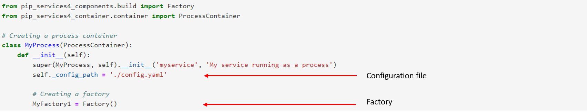
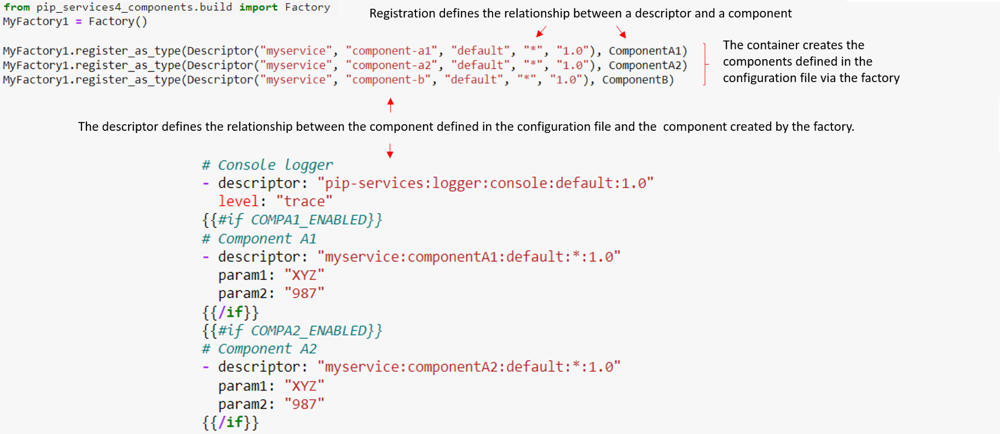
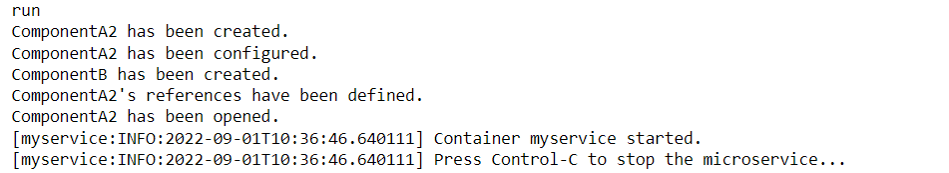



### Key takeaways

<table class="full-width-table">
  <tr>
    <td>Environment variables</td>
    <td>Variables that are a part of the running environment and whose value can affect the way processes function on a machine. It is considered a best practice to use environment variables for configuring applications.</td>
  </tr>
  <tr>
    <td>Configuration file</td>
    <td>File containing information about how to configure the container (i.e. which components to include).</td>
  </tr>
  <tr>
    <td>Factory</td>
    <td>Program that aids in the creation of components.</td>
  </tr>
  <tr>
    <td>Descriptor</td>
    <td>Component locator, consisting of the component’s group, type, kind, name, and version.</td>
  </tr>
  <tr>
    <td>References</td>
    <td>Special component that is used to store and locate components by their descriptors.</td>
  </tr>     
 </table>

### Introduction

This tutorial will explore the microservice configuration process. For this, we will first see an example that contains the main configuration aspects that most microservices have. Then, we will analyze how this process triggers and works. Finally, we will summarize what was learned.

### Example

The code below will be used to analyze how configurations work. It has two parts. The first contains three components: ComponentA1, ComponentA2, and ComponentB. The first two classes are basically the same except for their names. Both have ComponentB as a dependency. 

The second part contains the code used to package part 1 into a process container. This type of container acts as a system process and is based on the inversion of control pattern. Included in this part is a factory used by the container to create the components defined in part 1. 

Each of these features will be explained in detail in the analysis section.

#### Part 1: Components


  



  Not available 



  



  Not available 



  



  Not available  


#### Part 2: Container


   



  Not available 



  



  Not available 



  



  Not available  


### Analysis

Let’s now analyze the execution process happening in the above example. For this, we will follow a bottom-up approach and start from the code lines where the container execution is triggered. Then, we will continue up to the point where our component’s dependencies are created.

#### Environment variables

Pip.Services’ containerization approach allows us to perform component selections using the environment variables set in the execution environment. For example, if ComponentA1 is an in-memory persistence and ComponentA2 is a database persistence, we can select which to use in our container by setting the corresponding environment variable. Thus, our program starts by setting the environment variable COMPA1_ENABLED to true, which tells the container to include ComponentA1. Next, it triggers the execution of the container with the run() method.

#### Configuration file

Once the execution of the container is triggered, the program obtains its component configuration information from the configuration file, whose location is defined via the config_path variable. This will be a yaml file, containing information on the different components that the container must create.

The figure below shows the file for our example. It describes three components: a logger, ComponentA1, and ComponentA2. The logger is part of the set of components whose factories are called by the container by default. In this case, we select a console logger. 

Then, we have the other two components, each inside a conditional statement. This allows us to choose the one we need using the environment variables. Since we’ve defined COMPA1_ENABLED as true, the container selects ComponentA1 and ignores ComponentA2.  

#### Factory

With the information gathered from the environment variables and the configuration file, the container creates the required components via two kinds of factories: the default factories* that are part of the container and the custom factories we defined in our code. 

(*for more information on default factories, see the default container factory page of Pip.Services Docs for your programming language of choice: [Python](http://docs.pipservices.org/v4/toolkit_api/python/container/build/default_container_factory/), [Node.js](http://docs.pipservices.org/v4/toolkit_api/node/container/build/default_container_factory/), [.NET](http://docs.pipservices.org/v4/toolkit_api/net/container/build/default_container_factory/),  [Golang](http://docs.pipservices.org/v4/toolkit_api/golang/container/build/default_container_factory/) or [Dart](http://docs.pipservices.org/v4/toolkit_api/dart/container/build/default_container_factory/))

In our example, we create a factory for ComponentB, ComponentA1, and ComponentA2, and we register these components in it via [descriptors](../../component/descriptors/). This step provides a link between what was defined in the configuration file (using the same descriptors, just in a colon-separated format) and our components. Note that, even though our config file does not contain descriptors for ComponentB, we still register it in the factory. This is because ComponentB is a dependency for ComponentA1 and ComponentA2 and will be created by the program at a later step, when we start to set references.

#### References

Finally, when creating either ComponentA1 or ComponentA2, the program detects that this class has implemented the IReferenceable interface. Then, from the setReferences() method, it obtains the necessary information to create all required dependencies, which would be ComponentB in our case. This information is obtained from an instance of the References class, which retrieves information from the factory’s registered components.

Additionally, by implementing the [IConfigurable](../../tutorials/beginner_tutorials/configuration/component_configuration/) interface, we can set the values of the component’s parameters using the configure() method, which accepts a [ConfigParams](../../tutorials/beginner_tutorials/configuration/configurations/) object as a parameter. 

#### Results

The described process results in all required components being created and the following messages displayed on our screen:

Moreover, if we stop the process, we obtain the following messages on our screen:

Alternatively, if we choose to use ComponentA2 (e.g. by setting the COMPA2_ENABLED environment variable), we get the following results:

And, after stopping the process:

### Wrapping up

In this tutorial, we have explored a basic microservice configuration process. We started with an example containing two code parts. The first presents three classes, one of them acting as a component dependency for the other two. The second part of the code creates a factory and a container, which is then run. 

Then, in the following section, we analyzed each of the steps included in the configuration process. We saw how the container selects variables from the environment, obtains information about the components to be created from a configuration file, and creates them via the use of factories. 

Finally, we learned that the program obtains information about dependent components from the setReferences() method and creates the components defined there.

The final result is a microservice, running inside a container, that uses environment variables to create certain components at runtime and references to create additional components as dependencies.

