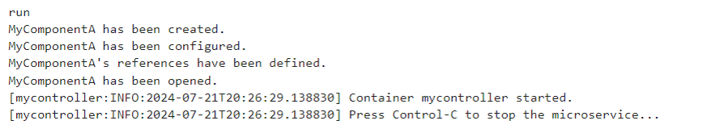



### Key takeaways

<table class="full-width-table">
  <tr>
    <td>ProcessContainer</td>
    <td>Container that can be used to run contained code as a system process.</td>
  </tr>
  <tr>
    <td>Custom component</td>
    <td>Custom component created for the tutorial's example.</td>
  </tr>
  <tr>
    <td>Factory</td>
    <td>Component used to create the contained components.</td>
  </tr>
  <tr>
    <td>Configuration file</td>
    <td>File used by the container to locate components.</td>
  </tr>
</table>

### Introduction

This tutorial will help you understand how to create a ProcessContainer that manages the life cycle of a custom component. First, we will see a brief description of the component and how to import it. Then, we will create a custom component, a factory to create it, and a process container. Finally, we will run the container and summarize all the learned concepts.

### The ProcessContainer container

[Docker](https://www.docker.com/resources/what-container/) defines a container as a standard unit of software that packages up code and all its dependencies so the application runs quickly and reliably from one computing environment to another.

Pip.Services offers the ProcessContainer, which allows us to run our contained code as a system process.

In this tutorial, we will create a ProcessContainer component that packages a custom component, run it, and check the results.

#### Pre-requisites

In order to use the ProcessContainer component, we need to import it first. This can be done with the following command:


 



 Not available  



   



 Not available  



  



  Not available  


#### Creating a component

Now, we create a component that will operate in a ProcessContainer. In our example, this is a mock component, that only prints a message once an operation is called. Moreover, to see how the container manages the lifecycle of this component, we want this class to be openable and configurable. An example of what this class looks like is:


  



 Not available  



  



 Not available  



  



  Not available  


#### Creating a factory

The next step is to create a factory for our component. For this, we create a class that extends the Factory class and registers our previously defined custom component. The following code shows how to do this:


  



 Not available  



  



 Not available  



  



  Not available  


#### Configuration file

Once our container and factory are ready, we create a configuration file that will be used by the ProcessContainer to locate the component. As the ProcessContainer class offers the possibility of using a logger, we also add a reference to it. In this manner, we will be able to see the logs on our console. The following code explains how to do this:

```yml
---
# Context information
- descriptor: "pip-services:context-info:default:default:1.0"
  name: mycontroller
  description: My controller is running in a process container

# Console logger
- descriptor: "pip-services:logger:console:default:1.0"
  level: {{LOG_LEVEL}}{{^LOG_LEVEL}}info{{/LOG_LEVEL}}

# Performance counters that posts values to log
- descriptor: "pip-services:counters:log:default:1.0"
  
# My component
- descriptor: "mycontroller:MyComponentA:default:*:1.0"
```

#### Creating a ProcessContainer

The final step is to create the ProcessContainer. To do this, we create a class that extends the ProcessContainer component. In it, we add our previously created factory and specify the path to our configuration file (The default path is ./config/config.yml). The following code shows how to do this:


  



 Not available  



  



 Not available  



  



  Not available  


#### Running the container

Now that our code is ready, we can run our container. This is done via its run() method. For example, in the code below, we create an instance of our container and call this method.


   



 Not available  



  



 Not available  



  



  Not available  


As a result, we get the following output on our console:



As we can see from the above results, the container takes care of the lifecycle of the packaged components:

1.	It obtains information about dependencies from the configuration file.
2.	Creates the packaged components via their respective factories.
3.	Configures the configurable components.
4.	Links the components to the components registered in their set_references() method.
5.	Opens the openable components.

Once the process is stopped, the container:

1.	Unlinks the linked components.
2.	Closes the opened components
3.	Closes itself.


#### Final code

Finally, we merge the code from the previous sections into one program:


  



 Not available  



  



 Not available  



  



  Not available  


### Wrapping up

In this tutorial, we have learned how to create a ProcessContainer. This component allows us to run our code as a system process. 

First, we created a custom component that is openable and configurable. Then, we created a factory to create this component via the container and a configuration file used by the container to locate the different components. Finally, we created the container, run it, and obtained an output on our console showing the creation, configuration and opening of our component.

The example in this tutorial used a custom component. The same procedure applies to the containerization of any other component or set of components.

