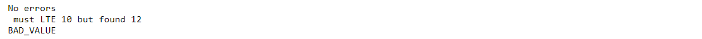



### Key takeaways

<table class="full-width-table">
  <tr>
    <td>Schema</td>
    <td>Defines validation schemas.</td>
  </tr>
  <tr>
    <td>NotRule</td>
    <td>Negates a rule.</td>
  </tr>
  <tr>
    <td>AndRule</td>
    <td>Validates combinations of rules created with AND logical operations.</td>
  </tr>
  <tr>
    <td>OrRule</td>
    <td>Validates combinations of rules created with OR logical operations.</td>
  </tr>
  <tr>
    <td>IncludedRule</td>
    <td>Checks that a list contains only specified values.</td>
  </tr>
  <tr>
    <td>ExcludedRule</td>
    <td>Verifies that none of the values specified in the rule is present in a list of constants.</td>
  </tr>
  <tr>
    <td>AtLeastOneExistsRule</td>
    <td>Checks that given a set of properties, at least one of them exists.</td>
  </tr>
  <tr>
    <td>ValueComparisonRule</td>
    <td>Compares a value to a constant.</td>
  </tr>

</table>

### Introduction

In this tutorial, we will learn how to use a set of validation rules available in the Pip.Services toolkit. First, we will see the necessary pre-requisites. Then, we will see the Schema class, which provides a way to create validation schemas. Lastly, we will see the different validation rules through the use of examples.

### Data validation

#### Pre-requisites

In order to perform validations, we need to import the Schema class and the different validation rules that we want to use. The following example shows how to import the Schema class and two validation rules named ValueComparisonRule and AndRule. 


  



  Not available  



   



  Not available  



  



  Not available  


#### The schema component

The Schema class provides a mechanism to create validation schemas, which can later be used to validate objects, project properties, arrays and maps. 

There are two ways to create a validation schema. The first is to create an instance of the Schema class and use a list with our validation rules as an input parameter. An example of this is:


   



  Not available  



   



  Not available  



  



  Not available  


Alternatively, we can first create an instance and define our rule using the with_rule() method. An example of this approach is:


  



  Not available  



   



  Not available  



  



  Not available  


#### Validation mechanism

To perform a validation based on a specified schema, we need to use the validate() method available from the Schema() class. 

This method returns an empty list if the validation was successful, and a list with result information if it wasn't. As a result, we need to differentiate between both cases, and for the unsuccessful option, we need to invoke the method get_message() and/or get_code() to obtain the reason for failure and/or the result code. 

In the example below, we examine two cases based on the rule that the value must be between one and ten. In the first case, we evaluate the value 0, which results in a BAD_VALUE code and the message "must GTE 1 but found 0". In the second case, we evaluate 5, which results in an empty list and the message "Value within range".


  



  Not available  



    



  Not available  



  



  Not available  


After running the above code, we get the following results:

#### Validation rules

Pip.Services provides a comprehensive set of validation rules. In this section, we will see an explanation and examples of each of them.

##### NotRule

The NotRule class allows us to negate a given rule. The examples below show how to use it.


   



  Not available  



   



  Not available  



  



  Not available  


After running the above code, we get the following output:

##### AndRule

The AndRule class allows us to validate combinations of rules created with AND logical operations. The examples below show how to use it.


    



  Not available  



   



  Not available  



  



  Not available  


After running the above code, we get the following output:

##### OrRule

The OrRule class allows us to validate combinations of rules created with OR logical operations. The examples below show how to use it.


  



  Not available  



   



  Not available  



  



  Not available  


After running the above code, we get the following output:

##### IncludedRule

The IncludedRule class allows us to check that a value is included in a given set of constants. The examples below show how to use it.


   



  Not available  



   



  Not available  



  



  Not available  


After running the above code, we get the following output:

##### ExcludedRule

The ExcludedRule allows us to verify that a value is not included in a given set of constants. The examples below show how to use it.


  



  Not available  



   



   Not available  



  



  Not available  


After running the above code, we get the following output:

##### AtLeastOneExistsRule

The AtLeastOneExistsRule class allows us to check that given a set of properties, at least one of them exists. The examples below show how to use it.


   



  Not available  



   



  Not available  



  



  Not available  


After running the above code, we get the following output:

##### ValueComparisonRule

The ValueComparisonRule class allows us to create a validation rule that compares a value to a constant. The following examples show how to use it.


    



  Not available  



   



  Not available  



  



  Not available  


After running the above code, we get the following output:

### Wrapping up

In this tutorial, we have seen how to create different types of validation rules and apply them to different situations. These rules included NotRule, AndRule, OrRule, IncludedRule, ExcludedRule and AtLestOneExistsRule. 

These rules are valuable in cases where we have to compile highly complex logical expressions, as they help to simplify our code, and thus, avoid unintentional errors.
