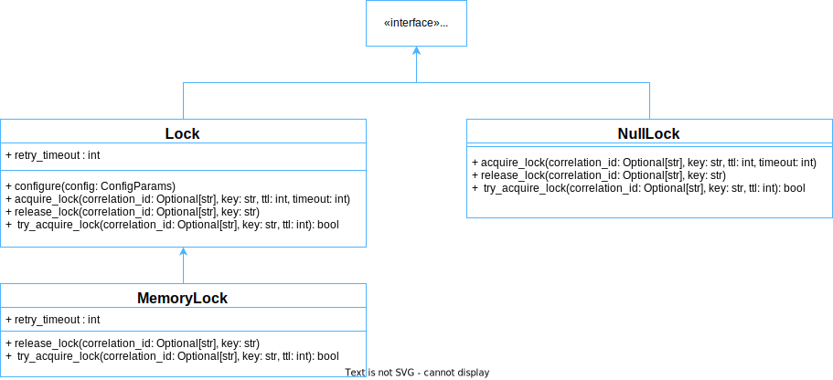



### Key takeaways

<table class="full-width-table">
   <tr>
    <td>ILock</td>
    <td>Interface that defines the main methods for locks.</td>
  </tr>
  <tr>
    <td>MemoryLock</td>
    <td>Lock used to synchronize the execution of processes that use shared memory.</td>
  </tr>
  <tr>
    <td>NullLock</td>
    <td>Dummy lock that performs no real actions.</td>
  </tr>
  <tr>
    <td>acquireLock()</td>
    <td>Method used to acquire a lock by its key.</td>
  </tr>
  <tr>
    <td>releaseLock()</td>
    <td>Method used to release a previously acquired lock by its key.</td>
  </tr>

</table>

### Introduction

This tutorial will help you understand how to use the MemoryLock and NullLock components. First, we will explore the ILock interface, which must be implemented by all locks. Next, we will learn the basic functionality of the MemoryLock class, and we will construct an example that will demonstrate how to use this type of lock. After this, we will learn what the NullLock is, how it differentiates from the MemoryLock, and when it should be used. At the end, we will summarize all the concepts learned.

### ILock

This interface defines the main methods that each lock must implement, specifically acquireLock(), tryAcquireLock() and releaseLock(). As their names suggest, the first two methods are used to acquire a lock, while the third is used to release an acquired lock. Both components, MemoryLock and NullLock, implement this interface. NullLock implements it directly, and MemoryLock - via its parent class Lock. The following diagram summarizes their relations:

### MemoryLock

This component provides us with a lock that can be used to synchronize the execution of processes that use shared memory. In addition to its own methods, it inherits two important methods from the Lock class: acquireLock() and configure(). The following sections explain how to create, configure, acquire and release this type of lock.  

#### Pre-requisites
In order to use this component, we need to import it first. The following example shows how to do this:


  



  Not available  



  



  Not available  



  



  Not available  


#### Lock creation

To create a lock, we just need to instantiate the MemoryLock class. The following line of code demonstrates this:


   



  Not available  



  



  Not available  



  



  Not available  


#### Lock configuration

Once we have an instance of a lock, we can configure the timeout (in milliseconds) to retry the lock acquisition via the configure() method. The default timeout is 100 milliseconds. In the following example, we override this default by setting the timeout to 200 milliseconds:


  



  Not available  



  



  Not available  



  



  Not available  


#### Lock acquisition

After creation, a lock can be acquired through the acquireLock() method. This method accepts the traceId, a key that identifies the lock, a lock timeout (milliseconds), and a lock acquisition timeout (milliseconds) as inputs. In the following example, we define the traceId equal to “123”, a key with the value “mykey”, and we set both timeouts to 1000 milliseconds:


   



  Not available  



  



  Not available  



  



  Not available  


#### Lock release

Once done with, a lock can be released via the releaseLock() method. This method accepts the traceId and the key of a previously acquired lock as inputs. In the following example, we use the same traceId and key as in the previous example. In this manner, we can keep track of the process and identify the previously acquired lock.


  



  Not available  



  



  Not available  



  



  Not available  


#### Example

Now that we have learned how to use the different methods available in this class, we can create an example that shows how they are used in practice. 

In this example, we define a custom component with two methods. The first stores a value in memory, while the second retrieves the stored value and returns it. Both methods use a lock to manage their operations.


   



  Not available  



  



  Not available  



  



  Not available  


And, after running the above code, we obtain the following results:

### NullLock

This component represents a dummy lock that produces no real results. As such, it can be used for testing purposes or in situations where a lock is required, but needs to be disabled. Another point worth mentioning is that this class doesn’t contain the configure() method. . 

#### Pre-requisites

In order to use this component, we need to import it first. The following example shows how to do this:


  



  Not available  



  



  Not available  



  



  Not available  


#### Lock creation

To create a NullLock, we need to instantiate it. The following line of code demonstrates this:


   



  Not available  



  



  Not available  



  



  Not available  


#### Lock acquisition and release

The Null lock class does possess the acquireLock() and releaseLock() methods, which can be called in the same manner as they were called for the MemoryLock class. The only difference is that they don’t actually acquire or release any locks, but only simulate these operations.

#### Example

The following example replaces the MemoryLock used in the previous example with a NullLock. Thus, the locking is only simulated and will not actually prevent simultaneous reading of and/or writing to shared memory.


   



  Not available  



  Not available  



  Not available  



  



  Not available  


Which, after running, produces the following outcome:

### Wrapping up

In this tutorial, we have learned how to use the MemoryLock and NullLock components. First, we examined the ILock interface, which must be implemented by all locks. Next, we learned that the MemoryLock class allows us to create a lock that can be used to synchronize the execution of processes that use shared memory. Then, we saw how to create, acquire and release this type of lock and an example of how to apply these mechanisms inside a component. Finally, we learned that the NullLock is a dummy component that only simulates the behavior of a real lock.

